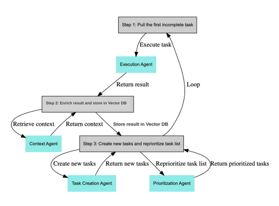
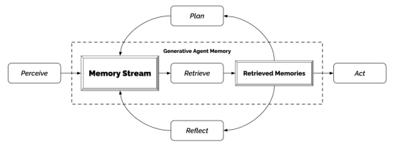
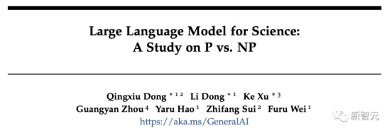
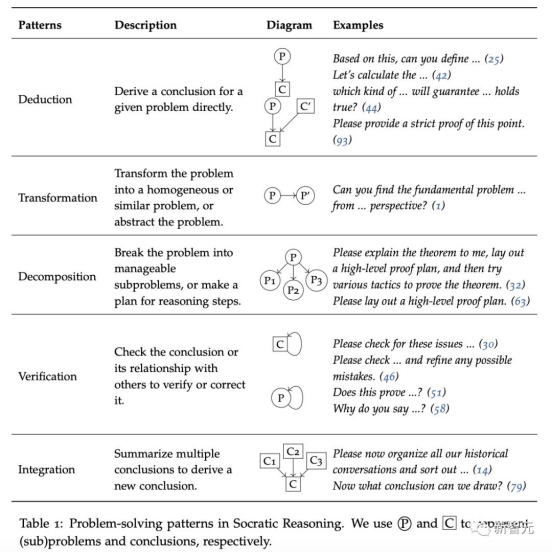
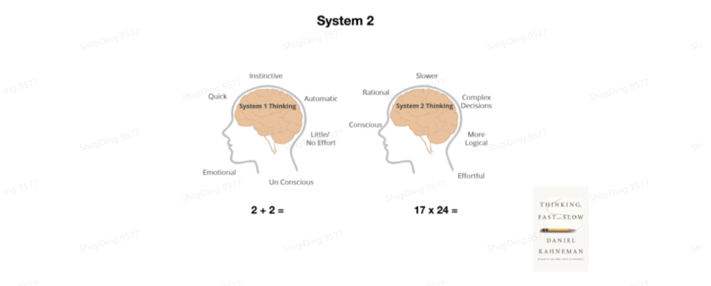
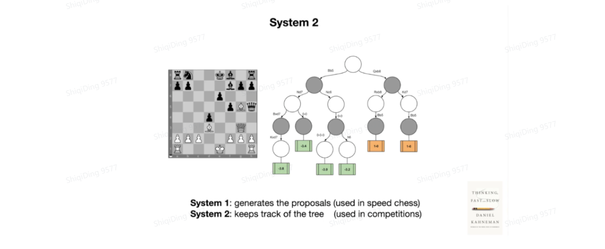
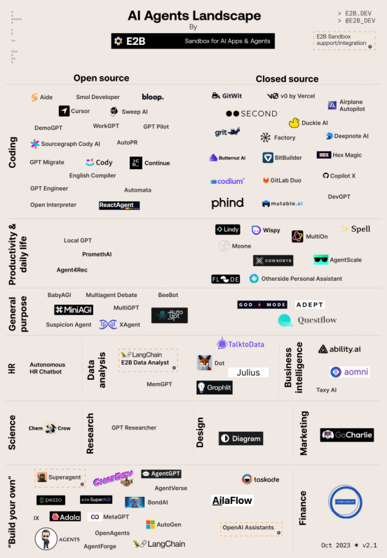

## 2.1 AI Agent体系介绍

### 2.1.1 什么是AI Agent：

> Agent（智能体） = 一个设置了一些目标或任务，可以迭代运行的大型语言模型。这与大型语言模型（LLM）在像ChatGPT这样的工具中“通常”的使用方式不同。在ChatGPT中，你提出一个问题并获得一个答案作为回应。而Agent拥有复杂的工作流程，模型本质上可以自我对话，而无需人类驱动每一部分的交互。                                                             
>
> **-**[**Logan Kilpatrick**](https://logankilpatrick.medium.com/), OpenAI 开发者关系负责人

ChatGPT接收单一查询的输入并返回输出，它一次不能完成超过一个任务。而AI Agent则可以自驱的定义工作流程并规划任务进行解决。比如，如果你有一个天气插件，当用户问“NYC（纽约缩写）的温度是多少？”，模型就会知道它无法回答这个问题，并查看用户安装的可用插件。假设它发送请求，API返回了一个错误信息，说“NYC不是一个有效的地点，请使用详细的城市名称，不要使用缩写”，模型实际上可以读取这个错误并发送新的请求来修复它。在这次人工智能的浪潮中AI Agent的火花诞生于 GPT插件商城以及AutoGPT。这分别提到Agent的工具调用能力和规划能力，在 LLM 支持的自主Agent系统中，LLM 充当Agents的大脑，并辅以几个关键组成部分：

• **规划**

​	￮ 子目标和分解：Agents将大型任务分解为更小的、可管理的子目标，从而能够有效处理复杂的任务。

​	￮ 反思和完善：Agents可以对过去的行为进行自我批评和自我反思，从错误中吸取教训，并针对未来的步骤进行完善，从而提高最终结果的质量。

• **记忆**

​	￮ 短期记忆：我认为所有的上下文学习（参见[提示工程](https://lilianweng.github.io/posts/2023-03-15-prompt-engineering/)）都是利用模型的短期记忆来学习。

​	￮ 长期记忆：这为Agents提供了长时间保留和回忆（无限）信息的能力，通常是通过利用外部向量存储和快速检索来实现。

• **工具使用**

​	￮ Agents学习调用外部 API 来获取模型权重中缺失的额外信息（通常在预训练后很难更改），包括当前信息、代码执行能力、对专有信息源的访问等。


​                        

​                         <p align="center">图 1. LLM 驱动的自主Agents系统概述参考[LLM Powered Autonomous AgentsLilian Weng（OpenAI研究主管）](https://lilianweng.github.io/posts/2023-06-23-agent/)</p>
            

在后续章节中我们将一一用代码用例实际带大家体验如何开发Agent，打通规划，记忆，工具调用等能力。

### 2.1.2 **智能体用例**

#### **概念验证Agent-BabyAGI**

Baby AGI 是一个 python 脚本，它使用 OpenAI 和 Pinecone API 以及 LangChain 框架来创建、组织、确定优先级以及执行任务。Baby AGI 背后的过程是，它将使用基于上一个任务结果的预定义目标创建一个任务。

这是通过使用 OpenAI 的自然语言处理 （NLP） 功能实现的，该功能允许系统根据目标创建新任务。它使用 Pinecone 来存储该特定任务的结果并检索上下文，并使用 LangChain 框架来处理决策过程。



​															  <p align="center">	来自 https://github.com/yoheinakajima/babyagi 的图片</p>					
这个过程在为智能体创建一个目标或主任务后，主要分为以下三个步骤：

1. 获取第一个未完成的任务
2.  丰富结果并存储在向量数据库中（如果你不清楚这意味着什么，没关系）
3. 创建新的任务并重新设置任务列表的优先级

根据目标开始任务，然后转到从内存中获取上下文的查询。然后将其发送到创建代理，创建代理获取数据并将其发送到内存。然后，它将通过一个队列，该队列将完成任务的优先级排序。

让我们一起来看一个具体的例子。我们可以从一个任务开始，例如"编写一篇关于ChatGPT以及功能的1500字博客文章"。作为控制agent的用户，你可以写出这个目标，尽可能详细地提供要求，然后你就完成了。

模型接收这些要求，并执行如下操作：

```txt
sub_tasks = openai.ChatCompletion.create(
  model="gpt-4",
  messages=[
    {"role": "system", "content": "You are an world class assistant designed to help people accomplishh tasks"},
    {"role": "user", "content": "Create a 1500 word blog post on ChatGPT and what it can do"},
    {"role": "user", "content": "Take the users request above and break it down into simple sub-tasks which can be easily done."}
  ]
)
```

在这个例子中，我们使用OpenAI API来驱动agent。系统消息允许你在一定程度上定义你的agent，但在这个例子中，我们并没有真正使用它。然后，我们添加用户查询和关键的下一步，即在其上添加一个任务，该任务是将查询分解成子任务。

然后，你可以将子任务放入一个循环中，并进行额外的调用以执行这些子任务，所有这些都带有不同的系统消息（想想不同的agents，可能是一个写作agent，一个研究agent等）。你可能会想要“将这个任务分解成更简单的子任务，直到你100%清楚需要做什么并且可以高精度地执行任务”，这样模型就不会陷入添加更多任务的无限循环中（如果你没有正确地进行提示工程，今天的agents就会常常出现这个问题）。

#### **生成Agents模拟**

**Generative Agents**（[Park 等人，2023](https://arxiv.org/abs/2304.03442)）是一个超级有趣的实验，其中 25 个虚拟角色，每个角色都由 LLM 支持的Agents控制，在沙盒环境中生活和交互，其灵感来自《模拟人生》。生成Agents为交互式应用程序创建可信的人类行为模拟。

生成Agents的设计将 LLM 与记忆、规划和反射机制相结合，使Agents能够根据过去的经验进行行为，并与其他Agents进行交互。

• **记忆流：** 是一个长期记忆模块（外部数据库），用自然语言记录智能体经验的完整列表。

​	￮ 每个元素都是一个观察结果，是由 Agent 直接提供的事件。代理人之间的交流可以引发新的自然语言陈述。

• **检索模型：** 根据相关性、新近度和重要性，呈现上下文以告知Agents的行为。

​	￮ 新近度：最近发生的事件得分较高

​	￮ 重要性：区分平凡记忆和核心记忆。直接问LM。

​	￮ 相关性：基于它与当前情况/查询的相关程度。

• **反射机制：** 随着时间的推移将记忆合成更高层次的推论，并指导智能体未来的行为。它们是*对过去事件的更高层次的总结（<-注意，这与上面的*[自我反思](https://lilianweng.github.io/posts/2023-06-23-agent/#self-reflection)有点不同）

​	￮ 提示 LM 提供 100 个最新观察结果，并根据这些观测/陈述生成3个最重要的高层次问题。然后让LM回答这些问题。

• **规划与反应**：将反思和环境信息转化为行动

​	￮ 规划本质上是为了优化当前与时间的可信度。

​	￮ 提示模板：

> ​	    {Intro of an agent X}. Here is X's plan today in broad strokes: 1)

​	￮ 规划和反应时都会考虑主体之间的关系以及一个主体对另一个主体的观察。环境信息以树形结构呈现。



 <p align="center">	图 13. 生成Agents架构。（图片来源：[Park 等人，2023](https://arxiv.org/abs/2304.03442)）</p>			
​														

这种有趣的模拟会产生新兴的社交行为，例如信息传播、关系记忆（例如，两个Agents继续讨论话题）和社交活动的协调（例如举办聚会并邀请许多其他人）。

#### **应用层的Moe-多人求解**

微软亚洲研究院、北大、北航等机构的研究人员，通过97个回合的「苏格拉底式」严格推理，成功让GPT-4得出了「P≠NP」的结论！



​															                 <p align="center">论文地址：https://arxiv.org/abs/2309.05689</p>			     

1971年，数学家Stephen A. Cook和Leonid Levin相对独立地提出这个问题：两个复杂度类P和NP是否是恒等的？

具体来说，一些永远无法通过简单计算得到答案的问题，就属于P/NP问题。

一个复杂问题如果能在多项式时间内解决，就被称为P问题，意味着计算机很容易将它求解。

那NP问题就是除了P问题之外的问题吗？未必。我们并不能证明一个问题能在多项式时间内解决，也无法证明它不能在多项式时间内解决。

**97轮对话，给出P≠NP结论**

在这项研究中，研究者GPT-4学会了一种「苏格拉底式推理」。

他们引入了**五个不同的角色（比如精通概率论的数学家），作为协助证明者，根据自己擅长证明不同的部分。**


简单讲，苏格拉底方法就是让我们「一步一步思考」，提出一系列问题激发批判性思维。

这对于大模型来说，如果能够进行批判性思考，就可以针对复杂问题提出高效的解决方案。

对此，研究团队指出这一框架旨在推动LLM解决高度复杂任务，协调各种子问题，并引导其搭建高层次推理途径。

「苏格拉底式推理」是在人类与LLM之间的一系列对话回合中进行的，是与LLM一起解决复杂挑战的递归机制。

如下图所示，「苏格拉底式推理」有5种强大的提示模式：演绎、转换、分解、验证、整合。

通过发掘新的见解和观点，将复杂问题分解为子问题或步骤，并通过质疑回答进行自我完善。



一般来说，在处理可以直接从推理中得出结论的问题时，会采用「演绎模式」（如 「让我们一步步思考」）来指导LLM直接得出结论。

对于更复杂的问题，首先要求LLM将问题转化为新问题，或分解为若干子问题。然后，通过递归方法，直到找到「原子问题」。


​																			 <p align="center">P vs. NP问题对话转换示例</p>			     

在生成新问题或得出新结论时，通过「验证模式」，利用LLM自我批判能力进行验证和完善。

最后，「整合模式」要求 LLM 基于子问题的结果合成结论。

整个流程，研究人员鼓励LLM通过一系列对话，递归地继续上述过程，直至解决目标问题。

### 2.1.3 **Sy1&Sy2给Agent的启发**

第一件事是关于系统 1 与系统 2 类型思维的概念，这个概念是由《思考，快与慢》这本书所普及的，所以这个区别是什么？这个想法是你的大脑可以以两种不同的模式运行。系统 1 思维是你的大脑的快速、本能和自动化的部分，所以例如，如果我问你 2+2 等于多少，你实际上并没有做数学计算。



你只是告诉我它等于四，因为这是可用的，已经存在于你的大脑中，是本能的。但是当我告诉你 17*24 等于多少时，你并没有准备好这个答案，所以你会启动你的大脑的另一部分，这部分更加理性，更加缓慢，进行复杂的决策，感觉更有意识。你不得不在脑海中解决这个问题，然后给出答案。

另一个例子是，如果你们中的一些人可能下象棋，当你进行快速象棋比赛时，你没有时间思考，所以你只是根据直觉移动棋子。这时大部分由你的系统 1 来处理。但如果你在比赛中，有更多时间来思考，那么你会更多地参与到决策中，你会感到自己在建立可能性的树，这是一个更有意识、更费力的过程。你必须在脑海中解决问题并给出答案。


现在事实证明， LLM 目前只有系统 1。它们只有这个本能部分。它们不能思考并推理出各种可能性。它们只是按顺序输入单词，并且基本上这些语言模型有一个神经网络，可以给出下一个单词，所以它就像右边的漫画一样，你只是在跟踪轨迹，这些语言模型基本上只是不断发出声音，这就是它们按照序列采样单词的方式。每个这样的块大致需要相同的时间，所以这基本上是 LLM 在系统 1 设置中的工作方式，所以很多人认为，赋予 LLM 系统 2 的能力会给人们带来灵活的时间，让它们更深入地思考问题，反思和重新表述，然后以更有信心的答案回来，所以你可以想象将时间表示为 x 轴，某种响应的准确度表示为 y 轴，当你绘制它时，你希望它是一个单调递增的函数。



今天这并不是这种情况，但很多人都在考虑这个问题，如何实际上创建一种思考的树状结构，思考问题，并反思和重新表述，然后回答时模型会更有信心，所以你可以想象将时间表示为 x 轴，某种响应的准确度表示为 y 轴，当你绘制它时，你希望它是一个单调递增的函数。今天这并不是这种情况，但很多人都在考虑这个问题。

### 2.1.4 **更多仓库以及产品：**

https://github.com/e2b-dev/awesome-ai-agents



