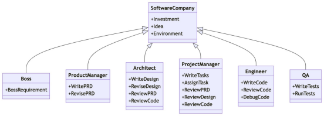
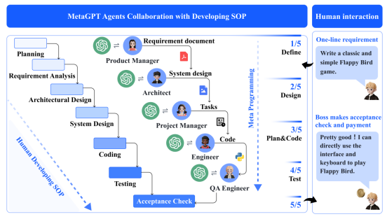
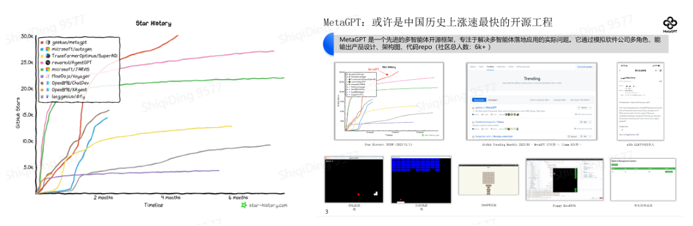

## 2.2 **多智能体框架介绍**

### 2.2.1 **什么是MetaGPT**

MetaGPT是一个多智能体协作框架，将标准化操作（**SOP**） 程序编码为提示确保解决问题时采用结构化方法。要求智能体以专家形式参与协作，并按要求生成结构化的输出，例如高质量的需求文档、架构设计图和流程图等。结构化的输出对于单个智能体即是更高层次的思维链（Chain-of-Thought），对于下游角色则是语义清晰、目标明确的上下文（Context）。通过明确定义的角色分工，复杂的工作得以分解为更小、更具体的任务。从而提升了LLMs的输出质量。

**主要特点：**

• **稳定的解决方案**：借助SOP，与其他 Agents 相比，MetaGPT 已被证明可以生成更一致和正确的解决方案。

• **多样化的角色分配**：为LLM分配不同角色的能力确保了解决问题的全面性。

```
在MetaGPT中多智能体 = 智能体+环境+SOP+评审+路由+订阅+经济
```

• **智能体**：在单个智能体的基础上，扩展了多智能体定义。在多智能体系统中，可以由多个单智能体协同工作，每个智能体都具备独特有的LLM、观察、思考、行动和记忆。

• **环境**：环境是智能体生存和互动的公共场所。智能体从环境中观察到重要信息，并发布行动的输出结果以供其他智能体使用。

• **标准流程（SOP）**：这些是管理智能体行动和交互的既定程序，确保系统内部的有序和高效运作。

• **评审**： 评审是为了解决幻觉问题。人类的幻觉实际高于大语言模型，但人类已经习惯了幻觉与错误，日常中会通过大量评审来保障复杂工作每一步的可靠性。严谨有效的评审过程能将复杂工作整体的错误率降低90%

• **路由**：通信是智能体之间信息交流的过程。它对于系统内的协作、谈判和竞争至关重要。

• **订阅**： 需求说了一个制度改革或市场变化，所有人都应该关注/判断影响/修改计划

• **经济**：这指的是多智能体环境中的价值交换系统，决定资源分配和任务优先级。

### 2.2.2 **经典案例：软件公司**

MetaGPT 以一行需求为输入，输出用户故事/竞争分析/需求/数据结构/API/文档等。

在内部，MetaGPT 包括产品经理/架构师/项目经理/工程师。它提供了软件公司的整个过程以及精心编排的 SOP。



1. **需求分析**：收到需求后，该过程开始。这一阶段致力于明确软件所需的功能和要求。
2. **产品经理**：产品经理以需求和可行性分析为基础，开启整个流程。他们负责理解需求，并为项目制定明确的方向。
3. **架构师**：一旦需求明确，架构师将为项目创建技术设计方案。他们负责构建系统接口设计，确保技术实现符合需求。在MetaGPT中，架构 Agent 可以自动生成系统界面设计，如内容推荐引擎的开发。
4. **项目经理**：项目经理使用序列流程图来满足每个需求。他们确保项目按计划前行，每个阶段都得到适时执行。
5. **工程师**：工程师负责实际的代码开发。他们使用设计和流程图，将其转化为功能完备的代码。
6. **质量保证（QA）工程师**：在开发阶段结束后，QA工程师进行全面的测试。他们确保软件符合所需标准，不存在任何错误或问题。



### 2.2.3 **更多关于MetaGPT**

详见我们的开源仓库：https://github.com/geekan/MetaGPT/

以及对应文章：[ICLR 2024 Oral | MetaGPT: LLM Agent领域第一高分论文，全网Star数最高的多智能体框架](https://mp.weixin.qq.com/s/LJFMBSlOJdJuzGh50s2Ugg)



1. **现状：**[MetaGPT](https://github.com/geekan/MetaGPT/)目前解决了软件工程的中程任务，**让用户不再只是与ChatGPT聊天，而是真正与智能体协作**。因此，MetaGPT获得了来自全世界的广泛好评（多天世界第一），也带来了全世界工程师、投资人的诸多关注，吸引了多位顶级贡献者（背景有字节AILab / 叮咚算法 / 小红书算法 / 百度 / MSRA / TikTok / bloomgpt infra / bilibili / CUHK / 港科 / CMU / UCB等背景）
2. **目标：** 希望能够拓展到任意行业任意天数的任务
3. **关键点：** ChatGPT只解决了聊天，并没有解决协作。而智能体可以与人类协作，意味着智能体会成为互联网级别的入口，并且会存在于大量的IM、硬件之中，取代已有的大量SaaS

### 2.2.4 **其他多智能体框架**

#### **ChatDev**

ChatDev 是一家虚拟软件公司，通过担任不同角色的各种智能代理进行运营，包括首席执行官、首席产品官、首席技术官 、程序员、审稿人 、测试人员 、艺术设计师 。这些代理形成了一个多代理组织结构，并因“通过编程彻底改变数字世界”的使命而团结在一起。ChatDev 中的代理通过参加专门的功能研讨会进行协作，包括设计、编码、测试和文档等任务。

#### **AutoAgents**

AutoAgents 是一个实验性的开源应用程序，用于基于 LLM的自动代理生成实验。该程序由 LLM驱动，自动生成多智能体以实现您设定的任何目标。

#### **agents**

Agents 是一个用于构建自治语言代理的开源库/框架。该库经过精心设计，可支持重要功能，包括长短期记忆、工具使用、网络导航、多智能体通信，以及包括人机交互和符号控制在内的全新功能。使用代理，只需用自然语言填写配置文件，即可自定义语言代理或多代理系统，并将语言代理部署在终端、Gradio界面或后端服务中。

Agents 与其他现有语言代理框架之间的一个主要区别是，我们的框架允许用户通过 SOP（标准操作流程）为语言代理提供细粒度的控制和指导。SOP 定义了整个任务的子目标/子任务，并允许用户为语言代理定制细粒度的工作流程。

#### **Camel**

基于对话和聊天的语言模型的快速发展在复杂任务解决方面取得了显着进展。然而，他们的成功在很大程度上依赖于人工输入来指导对话，这可能是具有挑战性和耗时的。本文探讨了建立可扩展技术的潜力，以促进交际代理之间的自主合作，并深入了解他们的“认知”过程。为了应对实现自主合作的挑战，我们提出了一种名为角色扮演的新型交际代理框架。我们的方法包括使用初始提示来指导聊天代理完成任务，同时保持与人类意图的一致性。我们展示了如何使用角色扮演来生成对话数据，以研究聊天代理的行为和能力，为研究对话语言模型提供宝贵的资源。我们的贡献包括引入一种新颖的交际代理框架，提供一种可扩展的方法来研究多智能体系统的协作行为和能力，以及开源我们的库以支持交际代理及其他方面的研究。

#### **AutoGen**

AutoGen 是一个框架，它支持使用多个代理开发LLM应用程序，这些代理可以相互交谈以解决任务。AutoGen 代理是可定制的、可对话的，并且无缝地允许人工参与。它们可以在各种模式下运行，这些模式采用人工输入和工具的LLMs组合。

#### 2.2.4.1 **参考资料：**

由于立场问题，我们不对其他开源项目做出任何评价，想要了解各个框架特性可以参考下文三方博客

https://www.breezedeus.com/article/ai-agent-part3
