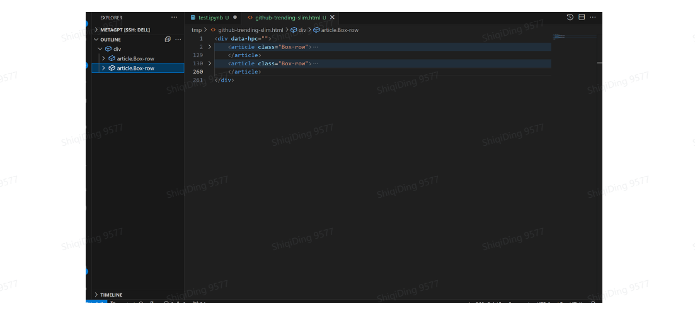
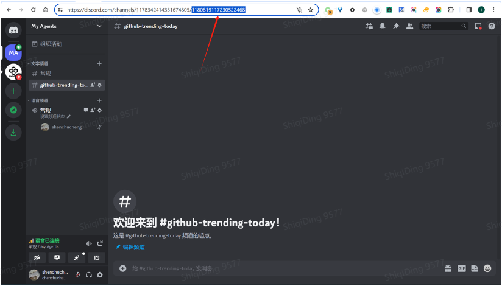

## 3.6 单智能体案例 OSS - 订阅智能体


### 3.6.1 基本介绍

#### 3.6.1.1 什么是订阅智能体

MetaGPT提供了Agent的开发能力，Agent可以协助我们解决日常的一些问题，其中 一个应用场景就是我们可以让Agent为我们关注某些想关注的信息，当有我们关注的事件发生时，Agent获取信息并进行处理，然后通过一些如邮件、微信、discord等通 知渠道将处理后的信息发送给我们，我们将这类Agent称为订阅智能体 在这里，Agent 的Role 是以一个“资讯订阅员”的身份为你服务，而 Agent 中包含的 Action则主要有两种：从外界信息源中搜集信息和对搜集得到的信息进行总结；完成 上述任务后，我们可以为这个Agent开发更多额外功能：定时运行的功能和发送到通 知渠道的功能x

#### 3.6.1.2 如何用 MetaGPT 实现订阅智能体

在 MetaGPT 中，metagpt.subscription 模块提供了 SubscriptionRunner 类，与 metagpt.team.Team 类似，SubscriptionRunner 类是提供了一个 Role 的运行方式， 基于 SubscriptionRunner 类，我们可以定时触发运行一个 Role，然后将 Role 的执行
输出通知给用户，例如，以下的示例：

```python
>>> import asyncio
>>> from metagpt.subscription import SubscriptionRunner
>>> from metagpt.roles import Searcher
>>> from metagpt.schema import Message

>>> async def trigger():
...     while True:
...         yield Message("the latest news about OpenAI")
...         await asyncio.sleep(3600 * 24)

>>> async def callback(msg: Message):
...     print(msg.content)

>>> async def main():
...     pb = SubscriptionRunner()
...     await pb.subscribe(Searcher(), trigger(), callback)
...     await pb.run()

>>> asyncio.run(main())
```

从例子可以知道订阅智能体的实现主要有3个要素，分别是Role、Trigger、Callback，即智能体本身、触发器、数据回调。如果之前已经学过了Agent的开发，那么对Role的实现肯定非常熟悉了，这边的Role就是我们的Agent的实际代码实现，所以订阅智能体在代码实现上并没有什么特别的地方，可以看到上面的例子实际运行的就是MetaGPT中的Searcher Role，它早就存在了我们的MetaGPT仓库中

不过需要注意的是，我们虽然不对订阅智能体的Role做限制，但是不是所有的Role都适合用来做订阅智能体，比如MetaGPT软件公司中的几个角色，例如产品经理、架构师、工程师等，因为当给这些Role一个需求输入时，它们的产出往往是类似的，并没有定时执行然后发送给我们能的必要。所以从应用的角度出发，订阅智能体的输出应该具有实时性，相同的一个需求描述输入，输出的内容一般是会随着时间的变化而不同，例如新闻资讯、技术前沿进展、热门的开源项目等。

所以，接下来我们本文档通过一个OSS（Open Source Software）订阅智能体实现示例教大家如何使用MetaGPT实现订阅智能体

### 3.6.2 教程信息

#### 3.6.2.1 前置准备

为了让大家在实操过程中有良好体验，在正式进入到本章节的实操环节之前，我们准备了以下的前置知识检查清单，这些都是在接下来实操时会用到的，如果以下清单所列内容都很熟悉，直接跳过即可；如果有不太清楚的点，可以根据建议先补齐一下前置知识

- 普通智能体的开发：参考前面的教程
- 网络爬虫
  - 基础的概念：
    - `HTML`：了解 HTML 的基本结构、标签和常见元素
    - `CSS`：了解 CSS 在 HTML 中的作用
    - 工具：使用浏览器开发者模式能定位网页元素
  - Python 工具
    - `aiohttp`：熟悉 [aiohttp](https://docs.aiohttp.org/en/stable/) 库的基本用法，会用aiohttp发起网络请求
    - `beautifulsoup`：了解HTML解析库 [BeautifulSoup](https://beautiful-soup-4.readthedocs.io/en/latest/)，掌握如何使用它从HTML中提取信息
- MetaGPT 订阅模块
  - `Role`、`Trigger`、`Callback`的概念
  - `Trigger`是个异步生成器，参考 https://peps.python.org/pep-0525/，知道如何实现即可

> 如果对爬虫不了解也不要紧，不要你精通爬虫，有基本了解即可，我们可以让ChatGPT 帮忙生成爬虫代码 

另外教程涉中需要访问到一些国外的网站，可能会遇到网络问题，因为 aiohttp 默认不走系统代理，所以需要做下代理配置。MetaGPT中已经提供了`GLOBAL_PROXY`参数用来表示全局代理配置，教程中遇到使用`aiohttp`进行请求的地方，都会将代理设置为`GLOBAL_PROXY`的值，所以可以通过在`config/key.yaml`配置文件中，添加自己代理服务器的配置，以解决网络问题：

```python
GLOBAL_PROXY: http://127.0.0.1:8118  # 改成自己的代理服务器地址
```

最后，[运行示例](https://deepwisdom.feishu.cn/docx/RJmTdvZuPozAxFxEpFxcbiPwnQf#ALhZdWRzzoDYy5xQXW6cCAZXnZf)章节提供了完整的代码，如果想先看下整体的运行效果，可以运行示例的main.py文件

#### 3.6.2.2 教程目标

通过本教程你可以：

1. 学习 MetaGPT 订阅模块的使用 
2. 实现一个属于自己的订阅智能体

### 3.6.3 OSS 订阅智能体实现

订阅智能体的实现主要有 3 个要素，分别是 Role、Trigger、Callback，即智能体本 身、触发器、数据回调。我们先拆解一下这个工作：

1. 实现一个 OSSWatcher 的 Role：OSS 即 Open source software，我们对OSS 智能体定位是，帮我们关注并分析热门的开源项目，当有相关信息时将信息推送给我们，这里需要确定让 OSS 从哪个网页获取信息
2. 触发 Trigger：指这个 OSSWatcher 角色运行的触发条件，可以是定时触发或者 是某个网站有更新时触发
3. 结果 Callback：处理 OSSWatcher 角色运行生成的信息，我们可以将数据发送到微信或者 discord接下来，我们一个一个地进行实现
### 3.6.4 OSSWatcher Role 实现

#### 3.6.4.1 基本分析

实现OSSWatcher的Role前，需要先确定我们要 OSSWatcher 做哪些事情，即需要实现哪些 Action，要分析热门开源项目，需要先获取热门开源项目信息，所以OSSWatcher可以拆分出两个Action，爬取热门开源项目和分析热门开源项目。

我们先确定从哪个网页获取信息，说到热门开源项目，我们首先想到的就是[GitHub Trending](https://github.com/trending)，Github Trending是Github主要板块子页面之一，主要展示指定时间段内Github上最受关注、热度上升的最快的资源库和开发者。它实际上是一个Github的一个资源库和开发者「热搜榜」，资源库按照时间段（每天、每周、每月）内获得的星星数量、fork数等指标排行。我们先打开 Github Trending 的网页，观察网页内容，以下是一些基本信息：

- 访问链接：https://github.com/trending
- 有筛选条件，主要有
  - spoken language：en/zh/...
  - language：html/javascript/python/go/java/...
  - since：daily/weekly/monthly

这是个静态网页，要爬取非常简单，如果有需要还可以根据条件进行筛选。网页爬取后，就可以对网页内容进行分析，例如以下的分析角度

1. 编程语言趋势：观察Trending列表中使用的编程语言，了解当前哪些编程语言在开发者社区中更受欢迎
2. 项目类型和用途：分析Trending列表中的项目，看看它们是属于哪些类别，以及它们的具体用途是什么
3. 社区活跃度：查看项目的星标数量、贡献者数量
4. 新兴技术和工具：注意新项目和涌现的技术，以便了解当前的技术趋势

以上是一些比较通用的角度，我们也可以根据自己的偏好进行分析，例如，主要关注AI领域的一些热门项目。基于以上，我们要做的事情就是，抓取Github Trending网页的信息，然后让LLM根据我们关注的角度进行分析，那么我们的OSSWatcher角色就完成了

#### 3.6.4.2 GitHub Trending 爬取

我们先来完成网页爬取的功能，我们教程直接爬取当天不分国家语言和编程语言的热门仓库进行分析，如果有特殊要求，爬取加上筛选条件条件后网页即可。我们先打开https://github.com/trending 网页，观察网页内容，找到我们需要的内容对应的 html 元素，


如果熟悉爬虫的就可以直接写爬取和解析脚本了，如果不熟悉的也没关系，我们可以
用 ChatGPT 辅助开发：
首先我们将图片所示的 html 复制出来，保存到 github-trending-raw.html，格式
化后发现内容非常多，大概600多k，还有一些svg源码，因为一般用CSS足以定位 html里的元素，所以我们可以对html内容进行瘦身，可以使用以下的脚本：

```python
from bs4 import BeautifulSoup

with open("github-trending-raw.html") as f:
    html = f.read()

soup = BeautifulSoup(html, "html.parser")
for i in soup.find_all(True):
    for name in list(i.attrs):
        if i[name] and name not in ["class"]:
            del i[name]

for i in soup.find_all(["svg", "img", "video", "audio"]):
    i.decompose()

with open("github-trending-slim.html", "w") as f:
    f.write(str(soup))
```

经过以上的脚本处理之后，大概还有100多k。对于爬虫来说，重要的是Html的结构，处理后的Html文件其实有大量的信息是重复的，如果我们要让GPT协助我们写爬虫脚本，只需要截取部分信息就可以了，榜单上有20个repo，我们只需要保留前两个

删减前：


删减后:



此时大小仅12k，这时候我们就可以用ChatGPT帮我们写爬取分析Github Trending的代码了，可以参考以下的对话：

https://chat.openai.com/share/6c8046d3-e363-40bd-9412-8d859e7b3854

最初给出的代码有报错，以及输出的Language为空，通过两次的对话让ChatGPT进行修复，最终得到以下代码：

```python
import aiohttp
import asyncio
from bs4 import BeautifulSoup

async def fetch_html(url):
    async with aiohttp.ClientSession() as session:
        async with session.get(url) as response:
            return await response.text()

async def parse_github_trending(html):
    soup = BeautifulSoup(html, 'html.parser')

    repositories = []

    for article in soup.select('article.Box-row'):
        repo_info = {}
        
        repo_info['name'] = article.select_one('h2 a').text.strip()
        repo_info['url'] = article.select_one('h2 a')['href'].strip()

        # Description
        description_element = article.select_one('p')
        repo_info['description'] = description_element.text.strip() if description_element else None

        # Language
        language_element = article.select_one('span[itemprop="programmingLanguage"]')
        repo_info['language'] = language_element.text.strip() if language_element else None

        # Stars and Forks
        stars_element = article.select('a.Link--muted')[0]
        forks_element = article.select('a.Link--muted')[1]
        repo_info['stars'] = stars_element.text.strip()
        repo_info['forks'] = forks_element.text.strip()

        # Today's Stars
        today_stars_element = article.select_one('span.d-inline-block.float-sm-right')
        repo_info['today_stars'] = today_stars_element.text.strip() if today_stars_element else None

        repositories.append(repo_info)

    return repositories

async def main():
    url = 'https://github.com/trending'
    html = await fetch_html(url)
    repositories = await parse_github_trending(html)

    for repo in repositories:
        print(f"Name: {repo['name']}")
        print(f"URL: https://github.com{repo['url']}")
        print(f"Description: {repo['description']}")
        print(f"Language: {repo['language']}")
        print(f"Stars: {repo['stars']}")
        print(f"Forks: {repo['forks']}")
        print(f"Today's Stars: {repo['today_stars']}")
        print()
```

稍微修改一下，把它作为一个Action类

1. 导入 

   ```python
   from metagpt.actions.action import Action
   from metagpt.config import CONFIG
   ```

2. 参考第三章1.2.2设计 action的异步run方法

   a. 创建 aiohttp.ClientSession 对象: 使用 `async with` 语句创建 aiohttp.ClientSession 对象，用于发送 HTTP 请求。

   b. 发送 GET 请求: 使用 `client.get()` 方法发送 GET 请求，并指定要访问的 URL。

   c. 设置代理: 通过 `proxy=CONFIG.global_proxy` 参数设置全局代理服务器。

   d. 检查响应状态: 使用 `response.raise_for_status()` 方法检查响应状态，如果状态码不为 200，则会抛出异常。

   e. 读取响应内容: 使用 `await response.text()` 方法读取响应内容并将其存储在 `html` 变量中。

   f. 返回 HTML 内容: 将获取到的 HTML 内容返回给调用者。

   ```python
   async def run(self, url: str = "https://github.com/trending"):
       async with aiohttp.ClientSession() as client:
           async with client.get(url, proxy=CONFIG.global_proxy) as response:
               response.raise_for_status()
               html = await response.text()
   ```

   

3. 在方法中将先前的parse_github_trending(html)方法搬运到action中用repositories做返回值

完整代码如下：

```python
import aiohttp
from bs4 import BeautifulSoup
from metagpt.actions.action import Action
from metagpt.config import CONFIG

class CrawlOSSTrending(Action):

    async def run(self, url: str = "https://github.com/trending"):
        async with aiohttp.ClientSession() as client:
            async with client.get(url, proxy=CONFIG.global_proxy) as response:
                response.raise_for_status()
                html = await response.text()
 
        soup = BeautifulSoup(html, 'html.parser')
    
        repositories = []
    
        for article in soup.select('article.Box-row'):
            repo_info = {}
            
            repo_info['name'] = article.select_one('h2 a').text.strip().replace("\n", "").replace(" ", "")
            repo_info['url'] = "https://github.com" + article.select_one('h2 a')['href'].strip()
    
            # Description
            description_element = article.select_one('p')
            repo_info['description'] = description_element.text.strip() if description_element else None
    
            # Language
            language_element = article.select_one('span[itemprop="programmingLanguage"]')
            repo_info['language'] = language_element.text.strip() if language_element else None
    
            # Stars and Forks
            stars_element = article.select('a.Link--muted')[0]
            forks_element = article.select('a.Link--muted')[1]
            repo_info['stars'] = stars_element.text.strip()
            repo_info['forks'] = forks_element.text.strip()
    
            # Today's Stars
            today_stars_element = article.select_one('span.d-inline-block.float-sm-right')
            repo_info['today_stars'] = today_stars_element.text.strip() if today_stars_element else None
    
            repositories.append(repo_info)
    
        return repositories
```

#### 3.6.4.3 GitHub Trending 总结

网页爬取的Action实现后，我们就可以让LLM基于爬取的网页内容进行分析了，这个 Action实现比较简单，主要是写提示词，在提示词中我们可以要求LLM从几个角度进 行分析，并按照一定的格式进行输出，例如

1. 今天榜单的整体趋势，例如哪几个编程语言比较热门、最热门的项目是哪些、主
   要集中在哪些领域
2. 榜单的仓库分类
3. 推荐进一步关注哪些仓库，推荐原因是什么

~~~python
from typing import Any
from metagpt.actions.action import Action

TRENDING_ANALYSIS_PROMPT = """# Requirements
You are a GitHub Trending Analyst, aiming to provide users with insightful and personalized recommendations based on the latest
GitHub Trends. Based on the context, fill in the following missing information, generate engaging and informative titles, 
ensuring users discover repositories aligned with their interests.

# The title about Today's GitHub Trending
## Today's Trends: Uncover the Hottest GitHub Projects Today! Explore the trending programming languages and discover key domains capturing developers' attention. From ** to **, witness the top projects like never before.
## The Trends Categories: Dive into Today's GitHub Trending Domains! Explore featured projects in domains such as ** and **. Get a quick overview of each project, including programming languages, stars, and more.
## Highlights of the List: Spotlight noteworthy projects on GitHub Trending, including new tools, innovative projects, and rapidly gaining popularity, focusing on delivering distinctive and attention-grabbing content for users.
---
# Format Example

```
# [Title]

## Today's Trends
Today, ** and ** continue to dominate as the most popular programming languages. Key areas of interest include **, ** and **.
The top popular projects are Project1 and Project2.

## The Trends Categories
1. Generative AI
    - [Project1](https://github/xx/project1): [detail of the project, such as star total and today, language, ...]
    - [Project2](https://github/xx/project2): ...
...

## Highlights of the List
1. [Project1](https://github/xx/project1): [provide specific reasons why this project is recommended].
...
```

---
# Github Trending
{trending}
"""

class AnalysisOSSTrending(Action):

    async def run(
        self,
        trending: Any
    ):
        return await self._aask(TRENDING_ANALYSIS_PROMPT.format(trending=trending))
~~~

#### 3.6.4.4 OSSWatcher Role 实现

以上 Action 都实现了，把它们都写到 metagpt/actions/oss_trending.py 文件 中，然后新建文件 metagpt/roles/oss_watcher.py，就可以写 Role 的代码了：

```python
from metagpt.actions.oss_trending import CrawlOSSTrending, AnalysisOSSTrending
from metagpt.roles import Role

class OssWatcher(Role):
    def __init__(
        self,
        name="Codey",
        profile="OssWatcher",
        goal="Generate an insightful GitHub Trending analysis report.",
        constraints="Only analyze based on the provided GitHub Trending data.",
    ):
        super().__init__(name, profile, goal, constraints)
        self._init_actions([CrawlOSSTrending, AnalysisOSSTrending])
        self._set_react_mode(react_mode="by_order")

    async def _act(self) -> Message:
        logger.info(f"{self._setting}: ready to {self._rc.todo}")
        # By choosing the Action by order under the hood
        # todo will be first SimpleWriteCode() then SimpleRunCode()
        todo = self.rc.todo

        msg = self.get_memories(k=1)[0] # find the most k recent messages
        result = await todo.run(msg.content)

        msg = Message(content=str(result), role=self.profile, cause_by=type(todo))
        self._rc.memory.add(msg)
        return msg
```

### 3.6.5 Trigger 实现

Trigger即触发器，代表了OSSWatcher角色的执行时机，最简单的触发方式即定时触发。Github Trending不是实时更新的，参考https://github.com/orgs/community/discussions/64295，大约是在10:00 AM UTC，实测更新时间不是很准时，所以我们可以一天触发一次，选取一个比较适合自己的推送时间即可，比如每天早上9点

以下提供一个定时Trigger的实现，要达到定时的目的，我们可以直接使用asyncio.sleep，例如：

```python
import asyncio
import time

from datetime import datetime, timedelta
from metagpt.schema import Message
from pydantic import BaseModel, Field


class OssInfo(BaseModel):
    url: str
    timestamp: float = Field(default_factory=time.time)


async def oss_trigger(hour: int, minute: int, second: int = 0, url: str = "https://github.com/trending"):
    while True:
        now = datetime.now()
        next_time = datetime(now.year, now.month, now.day, hour, minute, second)
        if next_time < now:
            next_time = next_time + timedelta(1)
        wait = next_time - now
        print(wait.total_seconds())
        await asyncio.sleep(wait.total_seconds())
        yield Message(url, OssInfo(url=url))
```

yield 语句被用于异步函数"oss_trigger"中，用于生成消息。每当调用这个异步函数时，它会在指定的时间间隔内生成一个消息，并在下一次调用时继续执行。此处我们预定义了`OssInfo`的结构，加入了时间戳的信息，并将其实例作为trigger生成的`Message`的`instruct_content`属性，作用是在早期的版本中，角色在接收Message会有一个去重操作，如果我们每次生成的`Message`只有url信息，那么第2次运行时，角色将不会接收新的`Message`，但是加入时间戳后，trigger生成的每个`Message`就不再相等，角色也会接收对应的`Message`

上述的简单例子，可以实现简单的按天定时触发的能力，不过如果需要更精细的控制，这个函数还需要继续优化。但我们可以借助一些第三方包实现这个功能，使用crontab实现定时触发是非常常见的一个做法，而且python也有一个异步的cron工具，即`aiocron`，使用`aiocron`我们可以直接使用cron的语法制定定时任务。上面我们使用了函数的方式来实现了定时Trigger异步生成器，接下来我们结合`aiocron`使用类的方式，来实现定时Trigger

```python
import time
from aiocron import crontab
from typing import Optional
from pytz import BaseTzInfo
from pydantic import BaseModel, Field
from metagpt.schema import Message

class GithubTrendingCronTrigger:
    def __init__(
        self,
        spec: str,
        tz: Optional[BaseTzInfo] = None,
        url: str = "https://github.com/trending",
    ) -> None:
        self.crontab = crontab(spec, tz=tz)
        self.url = url

    def __aiter__(self):
        return self

    async def __anext__(self):
        await self.crontab.next()
        return Message(content=self.url)

```

`基于aiocron`我们可以少写很多代码，功能也更加强大，可以用cron语法非常灵活地配置定时规则 如果您想指定UTC 时间 10:00 AM 触发

```python
# 创建 GithubTrendingCronTrigger 实例，指定每天 UTC 时间 10:00 AM 触发
cron_trigger = GithubTrendingCronTrigger("0 10 * * *")
```

如果您想指定北京时间上午8:00来触发这个任务，您需要做两件事：

1. 设置正确的 cron 表达式。
2. 确保时区设置正确。

北京时间是东八区（UTC+8），所以您应该在 `tz` 参数中设置相应的时区。而 cron 表达式遵循特定的格式，通常是：分钟、小时、日、月、星期几。

对于每天上午8:00，cron 表达式应该是 `"0 8 * * *"`，这表示每天的第8小时的第0分钟触发。

因此，您的 `GithubTrendingCronTrigger` 类的初始化代码应该类似于以下形式：

```python
from pytz import timezone
beijing_tz = timezone('Asia/Shanghai')  获取北京时间的时区
cron_trigger = GithubTrendingCronTrigger("0 8 * * *", tz=beijing_tz)
```

> 思考1：如果需要榜单更新再推送，可以如何实现？
>
> 思考2：Crontab的定时方式可能不是很方便进行调试，有什么方便调试的方法吗？

### 3.6.6 Callback 设计

#### 3.6.6.1 基础介绍

Callback就是定义了如何处理智能体生成的信息，它本身没有过多难点，但是如果想 将信息发送到我们日常使用的一些应用，可能会有一些成本。因此，本文档提供将智能体产生的数据发送到 discord/微信的示例供大家参考，其中 Discord 是一款免费的通 讯软件，让你可以与你的好友，社群以及开发者们进行语音，视频及文字聊天。目前，MetaGPT的海外社区就是在 Discord上维护的，在国内，MetaGPT也有庞大的 微信社区，所以本文档选取目前MetaGPT比较活跃的两个社区工具作为示例，其他 工具同理

#### 3.6.6.2 Discord

前置要求：注册账号、在[discord的开发者面板](https://discord.com/developers/applications)添加BOT，并将BOT添加到某个服务器中，参考https://discordpy.readthedocs.io/en/stable/discord.html

使用discord发送消息的示例如下：

```python
import asyncio
import discord


async def send_discord_msg(channel_id: int, msg: str, token: str):
    intents = discord.Intents.default()
    intents.message_content = True
    client = discord.Client(intents=intents)
    async with client:
        await client.login(token)
        channel = await client.fetch_channel(channel_id)
        await channel.send(msg)
```

不过discord单条消息有大小限制，过长的内容会导致发送不成功，我们可以按章节分多条msg发送，最终实现的`discord_callback`函数如下：

```python
import asyncio
import discord

from metagpt.config import CONFIG


async def discord_callback(msg: Message):
    intents = discord.Intents.default()
    intents.message_content = True
    client = discord.Client(intents=intents, proxy=CONFIG.global_proxy)
    token = os.environ["DISCORD_TOKEN"]
    channel_id = int(os.environ["DISCORD_CHANNEL_ID"])
    async with client:
        await client.login(token)
        channel = await client.fetch_channel(channel_id)
        lines = []
        for i in msg.content.splitlines():
            if i.startswith(("# ", "## ", "### ")):
                if lines:
                    await channel.send("\n".join(lines))
                    lines = []
            lines.append(i)

        if lines:
            await channel.send("\n".join(lines))
```

**DISCORD_TOKEN**参考官方文档[discord readthedocs](https://discordpy.readthedocs.io/en/stable/discord.html)，"Creating a Bot Account"章节的第7步：


DISCORD_CHANNEL_ID即希望Bot发送消息的频道，如下：



#### 3.6.6.3 Wechat

之前MetaGPT有尝试通过微信机器人同步不同社区群的消息，不过由于引起了过大的讨论，最终关闭了该功能，当时是使用wechaty实现的，但是使用该方式较为繁琐，而且由于我们的内容是markdown格式的，直接发送微信消息阅读体验较差，所以我们需要寻找合适的微信消息发送方式。公众号可以发送富本文消息，比较符合我们的场景，但是为了个推送的功能，开发个公众号的成本也是比较大，但是如果可以通过已有的一个公众号给我们发送消息，那实现将会非常简单。虽然微信官方没有提供类似的功能，但是已有许多的第三方公众号提供了消息推送的功能，例如server酱、wxpusher、Pushplus等，我们可以选择其中之一，例如wxpusher，它的代码是开源的，也有详细的文档，开发文档见：https://wxpusher.zjiecode.com/docs/#/

wxpusher虽然有python客户端，但是是同步的，但我们根据API文档，可以快速简单地实现一个异步的客户端：

```python
import os
from typing import Optional
import aiohttp


class WxPusherClient:
    def __init__(self, token: Optional[str] = None, base_url: str = "http://wxpusher.zjiecode.com"):
        self.base_url = base_url
        self.token = token or os.environ["WXPUSHER_TOKEN"]

    async def send_message(
        self,
        content,
        summary: Optional[str] = None,
        content_type: int = 1,
        topic_ids: Optional[list[int]] = None,
        uids: Optional[list[int]] = None,
        verify: bool = False,
        url: Optional[str] = None,
    ):
        payload = {
            "appToken": self.token,
            "content": content,
            "summary": summary,
            "contentType": content_type,
            "topicIds": topic_ids or [],
            "uids": uids or os.environ["WXPUSHER_UIDS"].split(","),
            "verifyPay": verify,
            "url": url,
        }
        url = f"{self.base_url}/api/send/message"
        return await self._request("POST", url, json=payload)

    async def _request(self, method, url, **kwargs):
        async with aiohttp.ClientSession() as session:
            async with session.request(method, url, **kwargs) as response:
                response.raise_for_status()
                return await response.json()
```

然后实现callback：

```python
async def wxpusher_callback(msg: Message):
    client = WxPusherClient()
    await client.send_message(msg.content, content_type=3)
```

**WXPUSHER_TOKEN**即wxpush的APP_TOKEN，参考[官方文档获取appToken](https://wxpusher.zjiecode.com/docs/#/?id=获取apptoken)


**WXPUSHER_UIDS**可以从应用管理页的”用户管理->用户列表“获取用户的UID，如果要发送给多个用户，可以用逗号将不同用户UID隔开


### 3.6.7 运行示例

以上基础的代码都开发完成了，接下来就是要运行了，考虑到为了能够在让上面的代码内容能够连贯，我们将它们写在一个main.py文件里，并进行回顾：

（完整代码下载：python版[main.py](https://deepwisdom.feishu.cn/wiki/MLILw0EdRiyiYRkJLgOcskyAnUh#QUlqdNrKkoTBFrxHKaucnGMsnzb)|notebook版[main.ipynb](https://deepwisdom.feishu.cn/wiki/MLILw0EdRiyiYRkJLgOcskyAnUh#HrOKdXk1jozUUpxHBSqcBR9znMg)）

~~~python
import asyncio
import os
from typing import Any, AsyncGenerator, Awaitable, Callable, Dict, Optional

import aiohttp
import discord
from aiocron import crontab
from bs4 import BeautifulSoup
from pydantic import BaseModel, Field
from pytz import BaseTzInfo

from metagpt.actions.action import Action
from metagpt.config import CONFIG
from metagpt.logs import logger
from metagpt.roles import Role
from metagpt.schema import Message

# fix SubscriptionRunner not fully defined
from metagpt.environment import Environment as _  # noqa: F401


# 订阅模块，可以from metagpt.subscription import SubscriptionRunner导入，这里贴上代码供参考
class SubscriptionRunner(BaseModel):
    """A simple wrapper to manage subscription tasks for different roles using asyncio.
    Example:
        >>> import asyncio
        >>> from metagpt.subscription import SubscriptionRunner
        >>> from metagpt.roles import Searcher
        >>> from metagpt.schema import Message
        >>> async def trigger():
        ...     while True:
        ...         yield Message("the latest news about OpenAI")
        ...         await asyncio.sleep(3600 * 24)
        >>> async def callback(msg: Message):
        ...     print(msg.content)
        >>> async def main():
        ...     pb = SubscriptionRunner()
        ...     await pb.subscribe(Searcher(), trigger(), callback)
        ...     await pb.run()
        >>> asyncio.run(main())
    """

    tasks: Dict[Role, asyncio.Task] = Field(default_factory=dict)

    class Config:
        arbitrary_types_allowed = True

    async def subscribe(
        self,
        role: Role,
        trigger: AsyncGenerator[Message, None],
        callback: Callable[
            [
                Message,
            ],
            Awaitable[None],
        ],
    ):
        """Subscribes a role to a trigger and sets up a callback to be called with the role's response.
        Args:
            role: The role to subscribe.
            trigger: An asynchronous generator that yields Messages to be processed by the role.
            callback: An asynchronous function to be called with the response from the role.
        """
        loop = asyncio.get_running_loop()

        async def _start_role():
            async for msg in trigger:
                resp = await role.run(msg)
                await callback(resp)

        self.tasks[role] = loop.create_task(_start_role(), name=f"Subscription-{role}")

    async def unsubscribe(self, role: Role):
        """Unsubscribes a role from its trigger and cancels the associated task.
        Args:
            role: The role to unsubscribe.
        """
        task = self.tasks.pop(role)
        task.cancel()

    async def run(self, raise_exception: bool = True):
        """Runs all subscribed tasks and handles their completion or exception.
        Args:
            raise_exception: _description_. Defaults to True.
        Raises:
            task.exception: _description_
        """
        while True:
            for role, task in self.tasks.items():
                if task.done():
                    if task.exception():
                        if raise_exception:
                            raise task.exception()
                        logger.opt(exception=task.exception()).error(
                            f"Task {task.get_name()} run error"
                        )
                    else:
                        logger.warning(
                            f"Task {task.get_name()} has completed. "
                            "If this is unexpected behavior, please check the trigger function."
                        )
                    self.tasks.pop(role)
                    break
            else:
                await asyncio.sleep(1)


# Actions 的实现
TRENDING_ANALYSIS_PROMPT = """# Requirements
You are a GitHub Trending Analyst, aiming to provide users with insightful and personalized recommendations based on the latest
GitHub Trends. Based on the context, fill in the following missing information, generate engaging and informative titles, 
ensuring users discover repositories aligned with their interests.

# The title about Today's GitHub Trending
## Today's Trends: Uncover the Hottest GitHub Projects Today! Explore the trending programming languages and discover key domains capturing developers' attention. From ** to **, witness the top projects like never before.
## The Trends Categories: Dive into Today's GitHub Trending Domains! Explore featured projects in domains such as ** and **. Get a quick overview of each project, including programming languages, stars, and more.
## Highlights of the List: Spotlight noteworthy projects on GitHub Trending, including new tools, innovative projects, and rapidly gaining popularity, focusing on delivering distinctive and attention-grabbing content for users.
---
# Format Example

```
# [Title]

## Today's Trends
Today, ** and ** continue to dominate as the most popular programming languages. Key areas of interest include **, ** and **.
The top popular projects are Project1 and Project2.

## The Trends Categories
1. Generative AI
    - [Project1](https://github/xx/project1): [detail of the project, such as star total and today, language, ...]
    - [Project2](https://github/xx/project2): ...
...

## Highlights of the List
1. [Project1](https://github/xx/project1): [provide specific reasons why this project is recommended].
...
```

---
# Github Trending
{trending}
"""


class CrawlOSSTrending(Action):
    async def run(self, url: str = "https://github.com/trending"):
        async with aiohttp.ClientSession() as client:
            async with client.get(url, proxy=CONFIG.global_proxy) as response:
                response.raise_for_status()
                html = await response.text()

        soup = BeautifulSoup(html, "html.parser")

        repositories = []

        for article in soup.select("article.Box-row"):
            repo_info = {}

            repo_info["name"] = (
                article.select_one("h2 a")
                .text.strip()
                .replace("\n", "")
                .replace(" ", "")
            )
            repo_info["url"] = (
                "https://github.com" + article.select_one("h2 a")["href"].strip()
            )

            # Description
            description_element = article.select_one("p")
            repo_info["description"] = (
                description_element.text.strip() if description_element else None
            )

            # Language
            language_element = article.select_one(
                'span[itemprop="programmingLanguage"]'
            )
            repo_info["language"] = (
                language_element.text.strip() if language_element else None
            )

            # Stars and Forks
            stars_element = article.select("a.Link--muted")[0]
            forks_element = article.select("a.Link--muted")[1]
            repo_info["stars"] = stars_element.text.strip()
            repo_info["forks"] = forks_element.text.strip()

            # Today's Stars
            today_stars_element = article.select_one(
                "span.d-inline-block.float-sm-right"
            )
            repo_info["today_stars"] = (
                today_stars_element.text.strip() if today_stars_element else None
            )

            repositories.append(repo_info)

        return repositories


class AnalysisOSSTrending(Action):
    async def run(self, trending: Any):
        return await self._aask(TRENDING_ANALYSIS_PROMPT.format(trending=trending))


# Role实现
class OssWatcher(Role):
    def __init__(
        self,
        name="Codey",
        profile="OssWatcher",
        goal="Generate an insightful GitHub Trending analysis report.",
        constraints="Only analyze based on the provided GitHub Trending data.",
    ):
        super().__init__(name=name, profile=profile, goal=goal, constraints=constraints)
        self._init_actions([CrawlOSSTrending, AnalysisOSSTrending])
        self._set_react_mode(react_mode="by_order")

    async def _act(self) -> Message:
        logger.info(f"{self._setting}: ready to {self.rc.todo}")
        # By choosing the Action by order under the hood
        # todo will be first SimpleWriteCode() then SimpleRunCode()
        todo = self.rc.todo

        msg = self.get_memories(k=1)[0]  # find the most k recent messages
        result = await todo.run(msg.content)

        msg = Message(content=str(result), role=self.profile, cause_by=type(todo))
        self.rc.memory.add(msg)
        return msg


# Trigger
class GithubTrendingCronTrigger:
    def __init__(
        self,
        spec: str,
        tz: Optional[BaseTzInfo] = None,
        url: str = "https://github.com/trending",
    ) -> None:
        self.crontab = crontab(spec, tz=tz)
        self.url = url

    def __aiter__(self):
        return self

    async def __anext__(self):
        await self.crontab.next()
        return Message(content=self.url)


# callback
async def discord_callback(msg: Message):
    intents = discord.Intents.default()
    intents.message_content = True
    client = discord.Client(intents=intents, proxy=CONFIG.global_proxy)
    token = os.environ["DISCORD_TOKEN"]
    channel_id = int(os.environ["DISCORD_CHANNEL_ID"])
    async with client:
        await client.login(token)
        channel = await client.fetch_channel(channel_id)
        lines = []
        for i in msg.content.splitlines():
            if i.startswith(("# ", "## ", "### ")):
                if lines:
                    await channel.send("\n".join(lines))
                    lines = []
            lines.append(i)

        if lines:
            await channel.send("\n".join(lines))


class WxPusherClient:
    def __init__(
        self,
        token: Optional[str] = None,
        base_url: str = "http://wxpusher.zjiecode.com",
    ):
        self.base_url = base_url
        self.token = token or os.environ["WXPUSHER_TOKEN"]

    async def send_message(
        self,
        content,
        summary: Optional[str] = None,
        content_type: int = 1,
        topic_ids: Optional[list[int]] = None,
        uids: Optional[list[int]] = None,
        verify: bool = False,
        url: Optional[str] = None,
    ):
        payload = {
            "appToken": self.token,
            "content": content,
            "summary": summary,
            "contentType": content_type,
            "topicIds": topic_ids or [],
            "uids": uids or os.environ["WXPUSHER_UIDS"].split(","),
            "verifyPay": verify,
            "url": url,
        }
        url = f"{self.base_url}/api/send/message"
        return await self._request("POST", url, json=payload)

    async def _request(self, method, url, **kwargs):
        async with aiohttp.ClientSession() as session:
            async with session.request(method, url, **kwargs) as response:
                response.raise_for_status()
                return await response.json()


async def wxpusher_callback(msg: Message):
    client = WxPusherClient()
    await client.send_message(msg.content, content_type=3)


# 运行入口，
async def main(spec: str = "0 9 * * *", discord: bool = True, wxpusher: bool = True):
    callbacks = []
    if discord:
        callbacks.append(discord_callback)

    if wxpusher:
        callbacks.append(wxpusher_callback)

    if not callbacks:

        async def _print(msg: Message):
            print(msg.content)

        callbacks.append(_print)

    async def callback(msg):
        await asyncio.gather(*(call(msg) for call in callbacks))

    runner = SubscriptionRunner()
    await runner.subscribe(OssWatcher(), GithubTrendingCronTrigger(spec), callback)
    await runner.run()


if __name__ == "__main__":
    import fire

    fire.Fire(main)
~~~

运行前，记得配置回调需要的环境变量：

```bash
export DISCORD_TOKEN=MTE3ODM0NzQ5NzA4MTU0NDg0NA.GqWXK2.xxxxxxxxxxxxxxxxxxxxxxxxxxxxxxx
export DISCORD_CHANNEL_ID=11783424143316xxxxxx
export WXPUSHER_TOKEN=AT_xxxxxxxxxxxxxxxxxxxxxx
export WXPUSHER_UIDS=UID_xxxxxxxxxxxxxxxxxxxxxxxxx
python main.py
```

效果如下：

- Discord

  

- WXPusher

  


