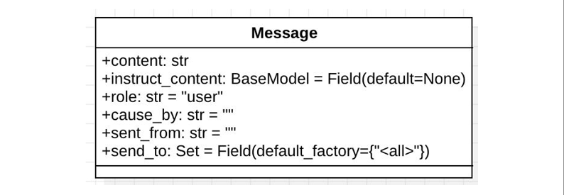

## 3.3 实现一个单动作Agent

下面将带领大家利用 MetaGPT 框架实现一个生成代码的 Agent SimpleCoder 我们希 望这个Agent 能够根据我们的需求来生成代码 要自己实现一个最简单的Role，只需要重写Role 基类的 _init_ 与 _act 方法 在 `_init_` 方法中，我们需要声明 Agent 的 `name`（名称）`profile`（类型）

我们使用 `self._init_action` 函数为其配备期望的动作 `SimpleWriteCode` 这个Action 应该能根据我们的需求生成我们期望的代码 在`_act`方法中，我们需要编写智能体具体的行动逻辑，智能体将从最新的记忆中获取 人类指令，运行配备的动作，MetaGPT 将其作为待办事项 (`self.rc.todo`) 在幕后 处理，最后返回一个完整的消息。

### 3.3.1 需求分析

要实现一个 `SimpleCoder` 我们需要分析这个Agent 它需要哪些能力


首先我们需要让他接受用户的输入的需求，并记忆我们的需求，接着这个Agent它需 要根据自己已知的信息和需求来编写我们需要的代码。

### 3.3.2 编写 SimpleWriteCode 动作

在 MetaGPT 中，类 `Action` 是动作的逻辑抽象。用户可以通过简单地调用
`self._aask` 函数 来获取 LLM 的回复。

 self._aask 函数如下：

```python
async def _aask(self, prompt: str, system_msgs: Optional[list[str]] = None) -> str:
    """Append default prefix"""
    if not system_msgs:
        system_msgs = []
    system_msgs.append(self.prefix)
    return await self.llm.aask(prompt, system_msgs)

```

它将调用你预设好的 LLM 来根据输出的提示词生成回答。

下面是实现SimpleWriteCode的具体代码：

```python
import re
import asyncio
from metagpt.actions import Action

class SimpleWriteCode(Action):

    PROMPT_TEMPLATE: str = """
    Write a python function that can {instruction} and provide two runnnable test cases.
    Return ```python your_code_here ``` with NO other texts,
    your code:
    """
    
    name: str = "SimpleWriteCode"

    async def run(self, instruction: str):
        prompt = self.PROMPT_TEMPLATE.format(instruction=instruction)
        rsp = await self._aask(prompt)
        code_text = SimpleWriteCode.parse_code(rsp)
        return code_text

    @staticmethod
    def parse_code(rsp):
        pattern = r'```python(.*)```'
        match = re.search(pattern, rsp, re.DOTALL)
        code_text = match.group(1) if match else rsp
        return code_text
```

在我们的场景中，我们定义了一个 `SimpleWriteCode` 类，它继承自 `Action`类，我们重写了`run` 方法，该方法决定了我们对传入的内容到底要做什么样的处理。

在类中设置 name 指定动作名称。

```python
    name: str = "SimpleWriteCode"
```

在`run`方法中，我们需要声明当采取这个行动时，我们要对传入的内容做什么样的处理，在 `SimpleWriteCode` 类中，我们应该传入：“请你帮我写一个XXX的代码” 这样的字符串，也就是用户的输入，`run`方法需要对它进行处理，把他交给llm，等到llm返回生成结果后，我们再取出其中的代码部分返回。

我们写好了一个提示词模板，将用户输入嵌入模板中

```python
PROMPT_TEMPLATE: str = """
    Write a python function that can {instruction} and provide two runnnable test cases.
    Return ```python your_code_here ``` with NO other texts,
    your code:
    """
prompt = self.PROMPT_TEMPLATE.format(instruction=instruction)
```

接着我们让大模型为我们生成回答

```python
rsp = await self._aask(prompt)
```

生成回答后，我们利用正则表达式提取其中的code部分，llm在返回给我们代码时通常用下面的形式返回

~~~python
```python
code内容
```
~~~

对应的正则提取内容如下：

`parse_code`方法使用正则表达式来匹配用户输入的代码文本。它会查找以"`python"开头，"`"结尾的代码块，并提取其中的代码内容。如果找到匹配的代码块，则返回提取的代码内容；否则，返回原始的用户输入。

```python
@staticmethod
def parse_code(rsp):
    pattern = r'```python(.*)```'
    match = re.search(pattern, rsp, re.DOTALL)
    code_text = match.group(1) if match else rsp
    return code_text
```

最后将代码内容返回

至此我们就完成了这样一个编写代码的动作。

### 3.3.3 设计SimpleCoder角色

在此之前我们需要简单介绍一下 Message，在MetaGPT中，Message 类是最基本的信息类型，Message 的基本组成如下



在本章节的学习中我们只涉及 content  role  cause_by ，除了content外，其他内容都是可选的

他们分别代表信息内容，发出信息的角色，以及是哪个动作导致产生的message

在编写完SimpleWriteCode动作后，我相信大家还有很多疑惑，比如如何调用这个动作？怎样把用户输入的内容传递给这个动作？

这部分内容我们都会在设计SimpleCoder角色的时候解决

```python
from metagpt.roles import Role
from metagpt.schema import Message
from metagpt.logs import logger

class SimpleCoder(Role):

    name: str = "Alice"
    profile: str = "SimpleCoder"

    def __init__(self, **kwargs):
        super().__init__(**kwargs)
        self._init_actions([SimpleWriteCode])

    async def _act(self) -> Message:
        logger.info(f"{self._setting}: ready to {self.rc.todo}")
        todo = self.rc.todo # todo will be SimpleWriteCode()

        msg = self.get_memories(k=1)[0] # find the most recent messages

        code_text = await todo.run(msg.content)
        msg = Message(content=code_text, role=self.profile, cause_by=type(todo))

        return msg
```

前面我们已经提到过实现一个最简单的Role，只需要指定 Role 的 name（昵称） 和 profile（人设），并重写Role基类的 `_init_` 与 `_act` 方法。

`__init__` 方法用来初始化这个Action，而 `_act` 方法决定了当这个角色行动时它的具体行动逻辑

我们在 `__init__` 方法中为 Role 配备了我们之前写好的动作 SimpleWriteCode。

```python
def __init__(self, **kwargs):
    super().__init__(**kwargs)
    self._init_actions([SimpleWriteCode])
```

配备好之后，我们定义的行动`SimpleWriteCode`就会被加入到代办`self.rc.todo`中，

在`_act`方法中，我们就会要求我们的智能体来执行这个动作，也就是我们需要调用`todo.run()`方法

```python
async def _act(self) -> Message:
    logger.info(f"{self._setting}: ready to {self.rc.todo}")
    todo = self.rc.todo  # todo will be SimpleWriteCode()
```

另外我们在 前面的action 中提到了，当action调用时，我们需要获取用户的输入来作为instruction传递给action，这里就涉及到我们该如何获取用户之前传递给agent的信息，在MetaGPT中，当用户与Agent交互时，所有的内容都会被存储在其自有的Memory中

在MetaGPT中，`Memory`类是智能体的记忆的抽象。当初始化时，`Role`初始化一个`Memory`对象作为`self.rc.memory`属性，它将在之后的`_observe`中存储每个`Message`，以便后续的检索。简而言之，`Role`的记忆是一个含有`Message`的列表。

当需要获取记忆时（获取LLM输入的上下文），我们可以使用`self.get_memories`。函数定义如下：

```python
def get_memories(self, k=0) -> list[Message]:
    """A wrapper to return the most recent k memories of this role, return all when k=0"""
    return self.rc.memory.get(k=k)
```

在SimpleCoder中，我们只需要获取最近的一条记忆，也就是用户下达的需求，将它传递给action即可

```python
msg = self.get_memories(k=1)[0]  # find the most recent messages
code_text = await todo.run(msg.content)
```

然后我们就将拿到大模型给我们的输出啦，最后我们将拿到的信息封装为MetaGPT中通信的基本格式 Message 返回，

这样，我们就实现了一个简单的单动作Agent

### 3.3.4 运行SimpleCoder角色

接下来你只需要初始化它并使用一个起始消息运行它。

```python
import asyncio

async def main():
    msg = "write a function that calculates the sum of a list"
    role = SimpleCoder()
    logger.info(msg)
    result = await role.run(msg)
    logger.info(result)

asyncio.run(main())
```

完整代码如下：

```python
import re
import asyncio
from metagpt.actions import Action
from metagpt.roles import Role
from metagpt.schema import Message
from metagpt.logs import logger

class SimpleWriteCode(Action):

    PROMPT_TEMPLATE = """
    Write a python function that can {instruction} and provide two runnable test cases.
    Return ```python your_code_here ``` with NO other texts,
    your code:
    """

    name: str = "SimpleWriteCode"

    async def run(self, instruction: str):
        prompt = self.PROMPT_TEMPLATE.format(instruction=instruction)
        rsp = await self._aask(prompt)
        code_text = SimpleWriteCode.parse_code(rsp)
        return code_text

    @staticmethod
    def parse_code(rsp):
        pattern = r'```python(.*)```'
        match = re.search(pattern, rsp, re.DOTALL)
        code_text = match.group(1) if match else rsp
        return code_text

class SimpleCoder(Role):
    def __init__(self, **kwargs):
        super().__init__(**kwargs)
        self._init_actions([SimpleWriteCode])

    async def _act(self) -> Message:
        logger.info(f"{self._setting}: ready to {self.rc.todo}")
        todo = self.rc.todo  # todo will be SimpleWriteCode()

        msg = self.get_memories(k=1)[0]  # find the most recent messages

        code_text = await todo.run(msg.content)
        msg = Message(content=code_text, role=self.profile,
                      cause_by=type(todo))

        return msg

async def main():
    msg = "write a function that calculates the sum of a list"
    role = SimpleCoder()
    logger.info(msg)
    result = await role.run(msg)
    logger.info(result)

asyncio.run(main())
```

