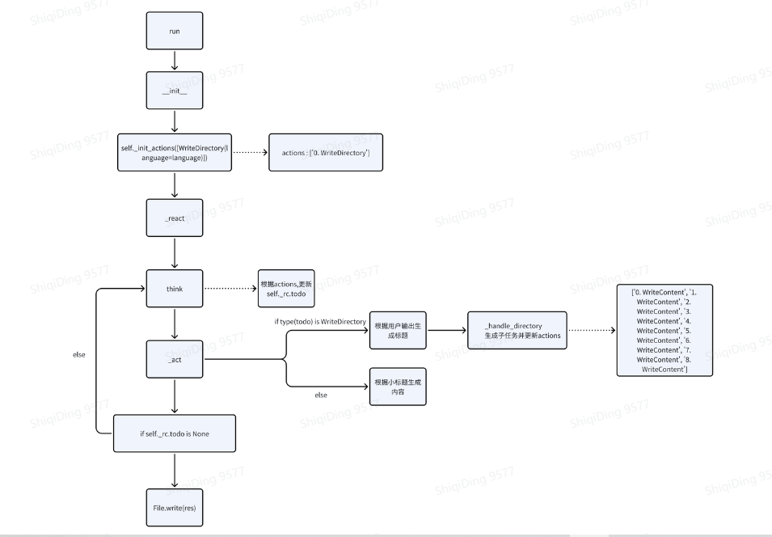

## 3.5 实现一个更复杂的 Agent：技术文档助手

在前文中我们已经介绍了如何实现一个简单的agent帮我们生成代码并执行代码，下 面我们将带领大家实现更复杂的agent，并向大家展示 MetaGPT中关于 agent的更多设计细节，现在试着想想怎么让大模型为我们写一篇技术文档？

可能想到的是，我们告诉大模型：“请帮我生成关于Mysql的技术文档”，他可能很快 地就能帮你完成这项任务，但是受限于大模型自身的token限制，我们无法实现让他 一次性就输出我们希望的一个完整的技术文档。

当然我们可以将我们的技术文档拆解成一个一个很小的需求，然后一个一个的提问，但是这样来说不仅费时，而且还需要人工一直去跟他交互，非常的麻烦，下面我们就将利用MetaGPT框架来解决这个问题 我们利用上文中提到的agent框架来拆解我们的需求

### 3.5.1 需求分析

因为token限制的原因，我们先通过 LLM 大模型生成教程的目录，再对目录按照二级 标题进行分块，对于每块目录按照标题生成详细内容，最后再将标题和内容进行拼接，解决 LLM 大模型长文本的限制问题。


### 3.5.2 编写 WriteDirectory 动作

我们先来实现根据用户需求生成文章大纲的代码

```python
class WriteDirectory(Action):
    """Action class for writing tutorial directories.

    Args:
        name: The name of the action.
        language: The language to output, default is "Chinese".
        
        用于编写教程目录的动作类。
        参数：
        name：动作的名称。
        language：输出的语言，默认为"Chinese"。
    """

    name: str = "WriteDirectory"
    language: str = "Chinese"

    async def run(self, topic: str, *args, **kwargs) -> Dict:
        """Execute the action to generate a tutorial directory according to the topic.

        Args:
            topic: The tutorial topic.

        Returns:
            the tutorial directory information, including {"title": "xxx", "directory": [{"dir 1": ["sub dir 1", "sub dir 2"]}]}.
        根据主题执行生成教程目录的操作。
            参数：
            topic：教程主题。
            返回：
            教程目录信息，包括{"title": "xxx", "directory": [{"dir 1": ["sub dir 1", "sub dir 2"]}]}.
        """
        COMMON_PROMPT = """
        You are now a seasoned technical professional in the field of the internet. 
        We need you to write a technical tutorial with the topic "{topic}".
        您现在是互联网领域的经验丰富的技术专业人员。
        我们需要您撰写一个关于"{topic}"的技术教程。
        """

        DIRECTORY_PROMPT = COMMON_PROMPT + """
        Please provide the specific table of contents for this tutorial, strictly following the following requirements:
        1. The output must be strictly in the specified language, {language}.
        2. Answer strictly in the dictionary format like {{"title": "xxx", "directory": [{{"dir 1": ["sub dir 1", "sub dir 2"]}}, {{"dir 2": ["sub dir 3", "sub dir 4"]}}]}}.
        3. The directory should be as specific and sufficient as possible, with a primary and secondary directory.The secondary directory is in the array.
        4. Do not have extra spaces or line breaks.
        5. Each directory title has practical significance.
        请按照以下要求提供本教程的具体目录：
        1. 输出必须严格符合指定语言，{language}。
        2. 回答必须严格按照字典格式，如{{"title": "xxx", "directory": [{{"dir 1": ["sub dir 1", "sub dir 2"]}}, {{"dir 2": ["sub dir 3", "sub dir 4"]}}]}}。
        3. 目录应尽可能具体和充分，包括一级和二级目录。二级目录在数组中。
        4. 不要有额外的空格或换行符。
        5. 每个目录标题都具有实际意义。
        """
        prompt = DIRECTORY_PROMPT.format(topic=topic, language=self.language)
        resp = await self._aask(prompt=prompt)
        return OutputParser.extract_struct(resp, dict)

```

基本就是我们把自己的需求放入我们准备好的提示词模板里，询问大模型得到结果，然后我们对得到的内容做一个解析。（数据格式化）

```python
def extract_struct(cls, text: str, data_type: Union[type(list), type(dict)]) -> Union[list, dict]:
    """Extracts and parses a specified type of structure (dictionary or list) from the given text.
    The text only contains a list or dictionary, which may have nested structures.

    Args:
        text: The text containing the structure (dictionary or list).
        data_type: The data type to extract, can be "list" or "dict".

    Returns:
        - If extraction and parsing are successful, it returns the corresponding data structure (list or dictionary).
        - If extraction fails or parsing encounters an error, it throw an exception.
    返回：
    - 如果提取和解析成功，它将返回相应的数据结构（列表或字典）。
    - 如果提取失败或解析遇到错误，则抛出异常。
    Examples:
        >>> text = 'xxx [1, 2, ["a", "b", [3, 4]], {"x": 5, "y": [6, 7]}] xxx'
        >>> result_list = OutputParser.extract_struct(text, "list")
        >>> print(result_list)
        >>> # Output: [1, 2, ["a", "b", [3, 4]], {"x": 5, "y": [6, 7]}]

        >>> text = 'xxx {"x": 1, "y": {"a": 2, "b": {"c": 3}}} xxx'
        >>> result_dict = OutputParser.extract_struct(text, "dict")
        >>> print(result_dict)
        >>> # Output: {"x": 1, "y": {"a": 2, "b": {"c": 3}}}
    """
    # Find the first "[" or "{" and the last "]" or "}"
    start_index = text.find("[" if data_type is list else "{")
    end_index = text.rfind("]" if data_type is list else "}")

    if start_index != -1 and end_index != -1:
        # Extract the structure part
        structure_text = text[start_index : end_index + 1]

        try:
            # Attempt to convert the text to a Python data type using ast.literal_eval
            result = ast.literal_eval(structure_text)

            # Ensure the result matches the specified data type
            if isinstance(result, list) or isinstance(result, dict):
                return result

            raise ValueError(f"The extracted structure is not a {data_type}.")

        except (ValueError, SyntaxError) as e:
            raise Exception(f"Error while extracting and parsing the {data_type}: {e}")
    else:
        logger.error(f"No {data_type} found in the text.")
        return [] if data_type is list else {}
```

注释里给了解析的example，这里再提一下

```python
>>> text = 'xxx [1, 2, ["a", "b", [3, 4]], {"x": 5, "y": [6, 7]}] xxx'
>>> result_list = OutputParser.extract_struct(text, "list")
>>> print(result_list)
>>> # Output: [1, 2, ["a", "b", [3, 4]], {"x": 5, "y": [6, 7]}]

>>> text = 'xxx {"x": 1, "y": {"a": 2, "b": {"c": 3}}} xxx'
>>> result_dict = OutputParser.extract_struct(text, "dict")
>>> print(result_dict)
>>> # Output: {"x": 1, "y": {"a": 2, "b": {"c": 3}}}
```

这样我们就将大模型输出的目录结构转为了可解析的字典对象，这里以写一篇Mysql教程文档为例，它的输出就如下：

```python
{'title': 'MySQL 教程', 'directory': [{'MySQL 简介': []}, {'安装与配置': ['安装MySQL', '配置MySQL']}, {'基本操作': ['创建数据库', '创建表', '插入数据', '查询数据', '更新数据', '删除数据']}, {'高级操作': ['索引', '约束', '连接查询', '子查询', '事务', '视图']}, {'备份与恢复': ['备份数据库', '恢复数据库']}, {'性能优化': ['优化查询语句', '优化表结构', '缓存配置']}, {'常见问题': ['连接问题', '权限问题', '性能问题']}]}
```

拿到目录后我们就需要根据每个章节的内容生成章节内容了

### 3.5.3 编写 WriteContent 动作

接下来我们需要根据传入的子标题来生成内容

```python
class WriteContent(Action):
    """Action class for writing tutorial content.

    Args:
        name: The name of the action.
        directory: The content to write.
        language: The language to output, default is "Chinese".
    """

    name: str = "WriteContent"
    directory: dict = dict()
    language: str = "Chinese"

    async def run(self, topic: str, *args, **kwargs) -> str:
        """Execute the action to write document content according to the directory and topic.

        Args:
            topic: The tutorial topic.

        Returns:
            The written tutorial content.
        """
        COMMON_PROMPT = """
        You are now a seasoned technical professional in the field of the internet. 
        We need you to write a technical tutorial with the topic "{topic}".
        """
        CONTENT_PROMPT = COMMON_PROMPT + """
        Now I will give you the module directory titles for the topic. 
        Please output the detailed principle content of this title in detail. 
        If there are code examples, please provide them according to standard code specifications. 
        Without a code example, it is not necessary.

        The module directory titles for the topic is as follows:
        {directory}

        Strictly limit output according to the following requirements:
        1. Follow the Markdown syntax format for layout.
        2. If there are code examples, they must follow standard syntax specifications, have document annotations, and be displayed in code blocks.
        3. The output must be strictly in the specified language, {language}.
        4. Do not have redundant output, including concluding remarks.
        5. Strict requirement not to output the topic "{topic}".
        现在我将为您提供该主题的模块目录标题。
        请详细输出此标题的详细原理内容。
        如果有代码示例，请按照标准代码规范提供。
        没有代码示例则不需要提供。
        
        该主题的模块目录标题如下：
        {directory}
        
        严格按照以下要求限制输出：
        1. 遵循Markdown语法格式进行布局。
        2. 如果有代码示例，必须遵循标准语法规范，具备文档注释，并以代码块形式显示。
        3. 输出必须严格使用指定语言{language}。
        4. 不得有冗余输出，包括总结性陈述。
        5. 严禁输出主题"{topic}"。
        """
        prompt = CONTENT_PROMPT.format(
            topic=topic, language=self.language, directory=self.directory)
        return await self._aask(prompt=prompt)
```

这里我们直接根据传入的子标题内容调用大模型生成回答即可

### 3.5.4 编写 TutorialAssistant 角色

编写完动作后，还有一个问题需要我们解决，按照我们的设计，大模型应该先调用WriteDirectory 动作去生成大纲，然后根据大纲的内容去生成对应的内容，**我们很难 把这整个流程都设计为固定流程，因为当我们需要生成的内容变化时，大纲的结构也会随之变化，当然你也可以在提示词中限制大纲的结构，但是这种解决方法无疑不够优雅而且灵活欠佳，这一章节内，我们将为你展示MetaGPT是如何组织Action的行 动路线的**

我们依然先定义相关字段，并重写 `__init__` 方法来初始化我们的角色。

```python
class TutorialAssistant(Role):
    """Tutorial assistant, input one sentence to generate a tutorial document in markup format.

    Args:
        name: The name of the role.
        profile: The role profile description.
        goal: The goal of the role.
        constraints: Constraints or requirements for the role.
        language: The language in which the tutorial documents will be generated.
    """

    name: str = "Stitch"
    profile: str = "Tutorial Assistant"
    goal: str = "Generate tutorial documents"
    constraints: str = "Strictly follow Markdown's syntax, with neat and standardized layout"
    language: str = "Chinese"

    topic: str = ""
    main_title: str = ""
    total_content: str = ""

    def __init__(self, **kwargs):
        super().__init__(**kwargs)
        self._init_actions([WriteDirectory(language=self.language)])
        self._set_react_mode(react_mode=RoleReactMode.BY_ORDER.value)

```

在`__init__`方法中我们声明了角色名称，角色类型，角色人物目的，以及constraints则是我们期望对输出内容的约束，我们希望内容最终以markdown格式输出方便我们导入到网页或者其他内容中

**这里需要注意的是我们在这里只初始化了WriteDirectory动作而没有初始化WriteContent动作，为什么呢？**

```python
def _init_actions(self, actions):
    self._reset()
    for idx, action in enumerate(actions):
        if not isinstance(action, Action):
            i = action("", llm=self._llm)
        else:
            if self._setting.is_human and not isinstance(action.llm, HumanProvider):
                logger.warning(f"is_human attribute does not take effect,"
                    f"as Role's {str(action)} was initialized using LLM, try passing in Action classes instead of initialized instances")
            i = action
        i.set_prefix(self._get_prefix(), self.profile)
        self.actions.append(i)
        self.states.append(f"{idx}. {action}")
        # 最后输出的样例 ['0. WriteContent', '1. WriteContent', '2. WriteContent', '3. WriteContent', '4. WriteContent', '5. WriteContent', '6. WriteContent', '7. WriteContent', '8. WriteContent']
```

首先我们根据 role 基类中定义的`_init_actions` 方法来看，当我们初始化一个动作时， 这个动作将被加入到 `self._actions` 中，而 self._actions 为一个列表，其中存储了我们 所有的动作。  

1. 首先，使用 enumerate函数来同时获取操作列表中的索引 idx 和对应的操作action。
2. 然后，检查每个 action是否是 Action 类的实例。如果不是，则创建一个新的 Action 实例并赋值给变量 i。 
3. 如果 action 是 Action 类的实例，会检查是否设置为人工操作（is_human）。如 果是，则会发出警告，并创建一个新的Action实例并将其赋值给变量i。 
4. 调用 i 的 set_prefix 方法，该方法用于设置操作的前缀。
5. 将 i 添加到_actions 列表中。
6. 将表示操作的字符串添加到_states 列表中。 

接着我们来查看Role基类中run方法的实现，当我们启动一个角色使他run时他会如何工作  


如果有入参message 就将message 添加到 role 的记忆中如果没有入参就观察环境中 的新消息

```python
async def run(self, message=None):
    """Observe, and think and act based on the results of the observation
        观察，并根据观察结果进行思考和行动。"""
    if message:
        if isinstance(message, str):
            message = Message(message)
        if isinstance(message, Message):
            self.recv(message)
        if isinstance(message, list):
            self.recv(Message("\n".join(message)))
         '''如果message存在，它会检查message的类型，
            如果是字符串，则将其转换为Message对象；
            如果是Message对象，则直接调用recv方法；
            如果是列表，则将列表中的消息合并成一个新的消息，然后再调用recv方法。
            相当于预处理将入参转化为Message对象并添加到role的记忆中'''
    elif not await self._observe():
        # If there is no new information, suspend and wait
        logger.debug(f"{self._setting}: no news. waiting.")
        return

    rsp = await self.react()
    # Publish the reply to the environment, waiting for the next subscriber to process
    self._publish_message(rsp)
    return rsp

```

recv方法的实现：

```python
def recv(self, message: Message) -> None:
    """add message to history."""
    # self._history += f"\n{message}"
    # self._context = self._history
    if message in self.rc.memory.get():
        return
    self.rc.memory.add(message)
```

首先它将接受用户的输入（message），然后观察环境信息（**目前我们还不涉及这部分内容**），接着我们将调用react方法来获取输出

```python
async def react(self) -> Message:
    """Entry to one of three strategies by which Role reacts to the observed Message
        通过观察到的消息，角色对其中一种策略进行反应。"""
    if self.rc.react_mode == RoleReactMode.REACT:
        rsp = await self._react()
    elif self.rc.react_mode == RoleReactMode.BY_ORDER:
        rsp = await self._act_by_order()
    elif self.rc.react_mode == RoleReactMode.PLAN_AND_ACT:
        rsp = await self._plan_and_act()
    self._set_state(state=-1) # current reaction is complete, reset state to -1 and todo back to None
    return rsp
```

当我们不指定react_mode 时将会执行`self._react()`方法，同时执行`self._set_state()`方法将初始化此时状态为-1

这里的state就代表当前agent需要执行动作的下标，当state为-1时，此时没有需要执行的action  self.rc.todo 此时就为空

```python
def _set_state(self, state: int):
    """Update the current state."""
    self.rc.state = state
    logger.debug(self.actions)
    self.rc.todo = self.actions[self.rc.state] if state >= 0 else None
```

再来看 self_react()方法  

￮ 先思考，然后行动，直到角色认为是时候停止并且不需要再做任何事情。
￮ 这是ReAct论文中的标准思考-行动循环，在任务解决中交替进行思考和行动，即`_思考 -> _行动 -> _思考 -> _行动 -> ...`
￮ 使用llm在思考过程中动态选择行动。   


函数中的`actions_taken` 变量用于跟踪已经执行的动作次数。在`while` 循环 中，函数会不断进行思考和行动，直到达到最大循环次数为止。在每次循环中，首先会调用`_think`方法，然后检查是否有待办事项。如果没有待办事项，循环将会终止。如果有待办事项，则会记录当前状态并执行相应的动作，然后增加`actions_taken` 的计数。  

最后，函数会返回最后一个动作的输出作为结果。

```python
async def _react(self) -> Message:
    """Think first, then act, until the Role _think it is time to stop and requires no more todo.
    This is the standard think-act loop in the ReAct paper, which alternates thinking and acting in task solving, i.e. _think -> _act -> _think -> _act -> ... 
    Use llm to select actions in _think dynamically
    """
    actions_taken = 0
    rsp = Message("No actions taken yet") # will be overwritten after Role _act
    while actions_taken < self.rc.max_react_loop:
        # think
        await self._think()
        if self.rc.todo is None:
            break
        # act
        logger.debug(f"{self._setting}: {self.rc.state=}, will do {self.rc.todo}")
        rsp = await self._act()
        actions_taken += 1
    return rsp # return output from the last action
```

*self*._react()方法基本决定了agent的行动路线，这里需要思考的是要实现我们期望的agent，他应该怎样行动？

我们重写_react方法如下：

**我们让agent先执行*self*._think()方法，在一个循环中思考目前需要做什么，思考完成后执行我们的动作，当没有需要采取的行动后我们就退出循环，把最后我们得到的最终结果写入至本地**

```python
async def _react(self) -> Message:
    """Execute the assistant's think and actions.

    Returns:
        A message containing the final result of the assistant's actions.
    执行助手的思考和行动。
    返回：
    包含助手行动最终结果的消息。
    """
    while True:
        await self._think()
        if self.rc.todo is None:
            break
        msg = await self._act()
    root_path = TUTORIAL_PATH / datetime.now().strftime("%Y-%m-%d_%H-%M-%S")
    await File.write(root_path, f"{self.main_title}.md", self.total_content.encode('utf-8'))
    return msg
```

_think方法负责更新当前需要触发的行为

我们重写_think方法如下：

当目前没有需要执行的动作，也就是之前分配的动作执行结束后 *self*.rc.todo为None时，让他执行目前action列表中初始的action，如果当前还没有执行到目前action列表的末尾，那么就执行下一个动作，否则将目前的*self*.rc.todo 置为None

```python
async def _think(self) -> None:
    """Determine the next action to be taken by the role."""
    if self.rc.todo is None:
        self._set_state(0)
        return

    if self.rc.state + 1 < len(self.states):
        self._set_state(self.rc.state + 1)
    else:
        self.rc.todo = None
```

思考结束后，这个角色就该行动起来了

我们重写_act方法如下：

`_act` 方法中我们将目前的todo内容按照action的类型分开处理，当目前需要生成目录时我们就获取用户的输入，传入 WriteDirectory action 内 生成对应的目录，最后，在 `_handle_directory` 方法中根据目录内容，我们生成子任务，也就是根据标题题目来生成内容，子任务生成结束后，我们使用self._init_actions更新目前的任务列表

当下次运行_act方法时，我们就将执行WriteContent 动作，来生成指定目录中的内容

```python
async def _act(self) -> Message:
    """Perform an action as determined by the role.

    Returns:
            A message containing the result of the action.
    """
    todo = self.rc.todo
    if type(todo) is WriteDirectory:
        msg = self.rc.memory.get(k=1)[0]
        self.topic = msg.content
        resp = await todo.run(topic=self.topic)
        logger.info(resp)
        return await self._handle_directory(resp)#将writedirector生成的目录一级标题actions添加到actions列表中。
    resp = await todo.run(topic=self.topic)
    logger.info(resp)
    if self.total_content != "":
        self.total_content += "\n\n\n"
    self.total_content += resp
    return Message(content=resp, role=self.profile)

async def _handle_directory(self, titles: Dict) -> Message:
    """Handle the directories for the tutorial document.

    Args:
        titles: A dictionary containing the titles and directory structure,
                such as {"title": "xxx", "directory": [{"dir 1": ["sub dir 1", "sub dir 2"]}]}

    Returns:
        A message containing information about the directory.
        处理教程文档的目录。
        参数：
        titles：包含标题和目录结构的字典，
        例如{"title": "xxx", "directory": [{"dir 1": ["sub dir 1", "sub dir 2"]}]}。
        返回值：
        包含目录信息的消息。
    """
    # 当生成目录后记录目录标题（因为最后要输出完整文档）
    self.main_title = titles.get("title")
    directory = f"{self.main_title}\n"
    # self.total_content用来存储最好要输出的所有内容
    self.total_content += f"# {self.main_title}"
    actions = list()
    for first_dir in titles.get("directory"):
        # 根据目录结构来生成新的需要行动的action（目前只设计了两级目录）
        actions.append(WriteContent(language=self.language, directory=first_dir))
        key = list(first_dir.keys())[0]
        directory += f"- {key}\n"
        for second_dir in first_dir[key]:
            directory += f"  - {second_dir}\n"
    self._init_actions(actions)
    self.rc.todo = None
    return Message(content=directory)
```

_handle_directory(self, titles: Dict)的GPT分析

>  **输入：{"title": "xxx", "directory": [{"dir 1": ["sub dir 1", "sub dir 2"]}]}**
>
> - `titles`字典: 包含教程的标题和目录结构。在这个例子中，标题是`"xxx"`，而目录结构是一个列表，其中包含一个字典，该字典定义了一个名为`"dir 1"`的目录，它又包含两个子目录`"sub dir 1"`和`"sub dir 2"`。
>
>  **函数处理流程**
>
> 1. 记录教程标题：首先，函数从`titles`字典中提取`"title"`键的值，并将其赋值给`self.main_title`。这里，`self.main_title`将被设置为`"xxx"`。
> 2. 初始化目录字符串：接着，函数创建一个名为`directory`的字符串，其初始内容是主标题（`self.main_title`），后面跟着一个换行符。
> 3. 更新总内容：将主标题添加到`self.total_content`字符串中，这是一个类的成员变量，用于存储最终要输出的所有教程内容。标题前面加上Markdown格式的一级标题标记。
> 4. 遍历目录项：接着，函数遍历`titles["directory"]`中的每个元素（这里只有一个元素，即`{"dir 1": ["sub dir 1", "sub dir 2"]}`）：
>    1. 对于每个一级目录（如`"dir 1"`），函数会：
>       - 创建一个`WriteContent`动作，将当前一级目录传入，并将其添加到`actions`列表中。
>       - 将一级目录标题添加到`directory`字符串中，前面加上Markdown格式的列表项标记`-`。
>    2. 接着，对于每个二级目录（如`"sub dir 1"`和`"sub dir 2"`），函数会将它们也添加到`directory`字符串中，但作为子列表项，前面加上`" - "`。
> 5. 初始化后续动作：使用`self._init_actions(actions)`，初始化`TutorialAssistant`对象的后续动作。这些动作基于刚刚创建的`actions`列表，即为每个目录项创建教程内容。
> 6. 清除待办事项：将`self``.rc.``todo`设置为`None`，表示当前没有更多待处理的事项。
> 7. 返回目录信息：最后，函数返回一个`Message`对象，其内容是经过格式化的目录字符串`directory`。
>
>   **例子输出**
>
> 以输入`{"title": "xxx", "directory": [{"dir 1": ["sub dir 1", "sub dir 2"]}]}`为例，函数输出的`Message`对象的内容将会是：
>
> xxx
>
> - dir 1
>   - sub dir 1
>   - sub dir 2
>
> 这个输出以Markdown格式展示了教程的主标题和目录结构，为后续创建教程内容提供了结构框架。

如果你还没有理解，这里我制作了一个简单的思维导图来帮助你梳理这个过程



### 3.5.5 运行 TutorialAssistant 角色

接下来你只需要初始化它并使用一个起始消息运行它。

```python
import asyncio

async def main():
    msg = "Git 教程"
    role = TutorialAssistant()
    logger.info(msg)
    result = await role.run(msg)
    logger.info(result)

asyncio.run(main())
```

完整代码如下：

```python
from datetime import datetime
from typing import Dict
import asyncio
from metagpt.actions.write_tutorial import WriteDirectory, WriteContent
from metagpt.const import TUTORIAL_PATH
from metagpt.logs import logger
from metagpt.roles.role import Role, RoleReactMode
from metagpt.schema import Message
from metagpt.utils.file import File

from typing import Dict

from metagpt.actions import Action
from metagpt.prompts.tutorial_assistant import DIRECTORY_PROMPT, CONTENT_PROMPT
from metagpt.utils.common import OutputParser

class WriteDirectory(Action):
    """Action class for writing tutorial directories.

    Args:
        name: The name of the action.
        language: The language to output, default is "Chinese".
    """

    name: str = "WriteDirectory"
    language: str = "Chinese"

    async def run(self, topic: str, *args, **kwargs) -> Dict:
        """Execute the action to generate a tutorial directory according to the topic.

        Args:
            topic: The tutorial topic.

        Returns:
            the tutorial directory information, including {"title": "xxx", "directory": [{"dir 1": ["sub dir 1", "sub dir 2"]}]}.
        """
        COMMON_PROMPT = """
        You are now a seasoned technical professional in the field of the internet. 
        We need you to write a technical tutorial with the topic "{topic}".
        """

        DIRECTORY_PROMPT = COMMON_PROMPT + """
        Please provide the specific table of contents for this tutorial, strictly following the following requirements:
        1. The output must be strictly in the specified language, {language}.
        2. Answer strictly in the dictionary format like {{"title": "xxx", "directory": [{{"dir 1": ["sub dir 1", "sub dir 2"]}}, {{"dir 2": ["sub dir 3", "sub dir 4"]}}]}}.
        3. The directory should be as specific and sufficient as possible, with a primary and secondary directory.The secondary directory is in the array.
        4. Do not have extra spaces or line breaks.
        5. Each directory title has practical significance.
        """
        prompt = DIRECTORY_PROMPT.format(topic=topic, language=self.language)
        resp = await self._aask(prompt=prompt)
        return OutputParser.extract_struct(resp, dict)

class WriteContent(Action):
    """Action class for writing tutorial content.

    Args:
        name: The name of the action.
        directory: The content to write.
        language: The language to output, default is "Chinese".
    """

    name: str = "WriteContent"
    directory: dict = dict()
    language: str = "Chinese"

    async def run(self, topic: str, *args, **kwargs) -> str:
        """Execute the action to write document content according to the directory and topic.

        Args:
            topic: The tutorial topic.

        Returns:
            The written tutorial content.
        """
        COMMON_PROMPT = """
        You are now a seasoned technical professional in the field of the internet. 
        We need you to write a technical tutorial with the topic "{topic}".
        """
        CONTENT_PROMPT = COMMON_PROMPT + """
        Now I will give you the module directory titles for the topic. 
        Please output the detailed principle content of this title in detail. 
        If there are code examples, please provide them according to standard code specifications. 
        Without a code example, it is not necessary.

        The module directory titles for the topic is as follows:
        {directory}

        Strictly limit output according to the following requirements:
        1. Follow the Markdown syntax format for layout.
        2. If there are code examples, they must follow standard syntax specifications, have document annotations, and be displayed in code blocks.
        3. The output must be strictly in the specified language, {language}.
        4. Do not have redundant output, including concluding remarks.
        5. Strict requirement not to output the topic "{topic}".
        """
        prompt = CONTENT_PROMPT.format(
            topic=topic, language=self.language, directory=self.directory)
        return await self._aask(prompt=prompt)

class TutorialAssistant(Role):
    """Tutorial assistant, input one sentence to generate a tutorial document in markup format.

    Args:
        name: The name of the role.
        profile: The role profile description.
        goal: The goal of the role.
        constraints: Constraints or requirements for the role.
        language: The language in which the tutorial documents will be generated.
    """

    name: str = "Stitch"
    profile: str = "Tutorial Assistant"
    goal: str = "Generate tutorial documents"
    constraints: str = "Strictly follow Markdown's syntax, with neat and standardized layout"
    language: str = "Chinese"

    topic: str = ""
    main_title: str = ""
    total_content: str = ""

    def __init__(self, **kwargs):
        super().__init__(**kwargs)
        self._init_actions([WriteDirectory(language=self.language)])
        self._set_react_mode(react_mode=RoleReactMode.BY_ORDER.value)

    async def _think(self) -> None:
        """Determine the next action to be taken by the role."""
        logger.info(self.rc.state)
        logger.info(self,)
        if self.rc.todo is None:
            self._set_state(0)
            return

        if self.rc.state + 1 < len(self.states):
            self._set_state(self.rc.state + 1)
        else:
            self.rc.todo = None

    async def _handle_directory(self, titles: Dict) -> Message:
        """Handle the directories for the tutorial document.

        Args:
            titles: A dictionary containing the titles and directory structure,
                    such as {"title": "xxx", "directory": [{"dir 1": ["sub dir 1", "sub dir 2"]}]}

        Returns:
            A message containing information about the directory.
        """
        self.main_title = titles.get("title")
        directory = f"{self.main_title}\n"
        self.total_content += f"# {self.main_title}"
        actions = list()
        for first_dir in titles.get("directory"):
            actions.append(WriteContent(
                language=self.language, directory=first_dir))
            key = list(first_dir.keys())[0]
            directory += f"- {key}\n"
            for second_dir in first_dir[key]:
                directory += f"  - {second_dir}\n"
        self._init_actions(actions)
        self.rc.todo = None
        return Message(content=directory)

    async def _act(self) -> Message:
        """Perform an action as determined by the role.

        Returns:
            A message containing the result of the action.
        """
        todo = self.rc.todo
        if type(todo) is WriteDirectory:
            msg = self.rc.memory.get(k=1)[0]
            self.topic = msg.content
            resp = await todo.run(topic=self.topic)
            logger.info(resp)
            return await self._handle_directory(resp)
        resp = await todo.run(topic=self.topic)
        logger.info(resp)
        if self.total_content != "":
            self.total_content += "\n\n\n"
        self.total_content += resp
        return Message(content=resp, role=self.profile)

    async def _react(self) -> Message:
        """Execute the assistant's think and actions.

        Returns:
            A message containing the final result of the assistant's actions.
        """
        while True:
            await self._think()
            if self.rc.todo is None:
                break
            msg = await self._act()
        root_path = TUTORIAL_PATH / datetime.now().strftime("%Y-%m-%d_%H-%M-%S")
        await File.write(root_path, f"{self.main_title}.md", self.total_content.encode('utf-8'))
        return msg

async def main():
    msg = "Git 教程"
    role = TutorialAssistant()
    logger.info(msg)
    result = await role.run(msg)
    logger.info(result)

asyncio.run(main())
```

v0.6.6版本的完整代码也可以参考代码仓库：

https://github.com/geekan/MetaGPT/blob/v0.6.6/metagpt/actions/write_tutorial.py

https://github.com/geekan/MetaGPT/blob/v0.6.6/metagpt/roles/tutorial_assistant.py

