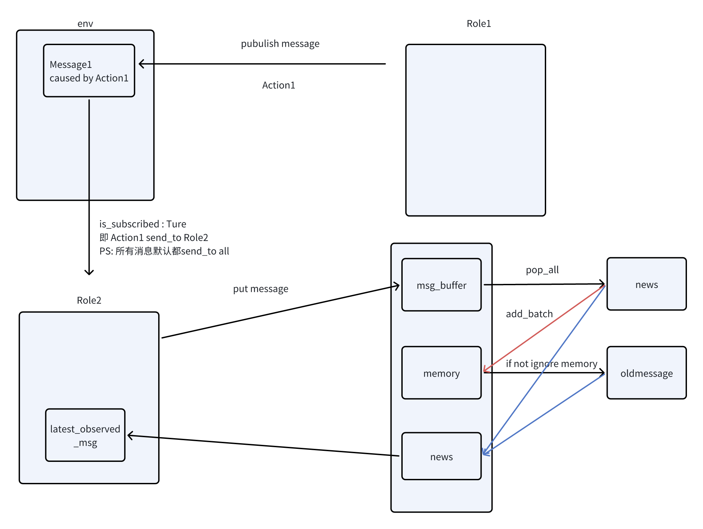
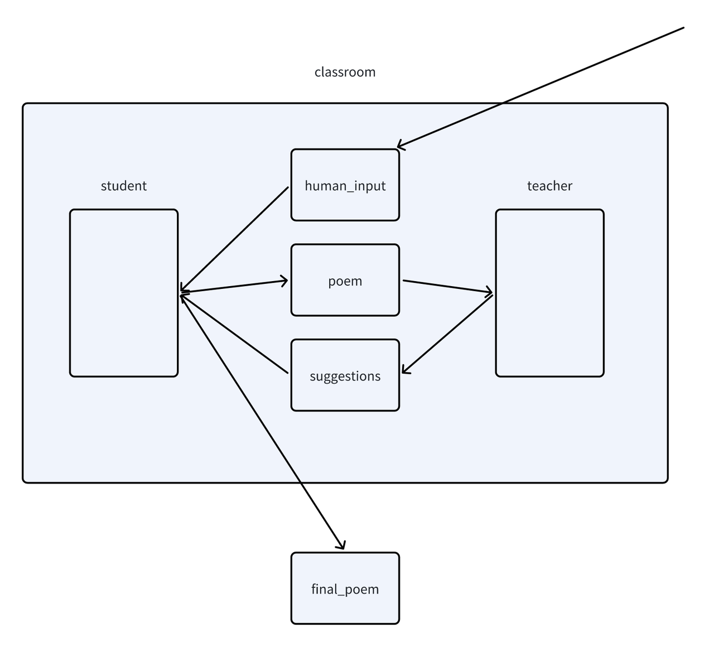

## 4.2 多智能体组件介绍

### 4.2.1 Environment
Environment 这个概念，我们更多熟识于强化学习领域的 agent 与 Environment,在强化学习中 Agent 需要学习在环境中采取行动来最大化一些累积奖励，Agent 能够采取的行动，也就是 Agent 的 action space 往往受到环境的限制，环境中通常具有一定的规则，而agent 们必须按照规则进行活动，MetaGPT提供了一个标准的环境组件Environment，来管理agent的活动与信息交流

MetaGPT 源码中是这样介绍 Environment 的：

> 环境，承载一批角色，角色可以向环境发布消息，可以被其他角色观察到
>
> Environment, hosting a batch of roles, roles can publish messages to the environment, and can be observed by other roles

来看 Environment 的基本组成

```python
class Environment(BaseModel):
    """环境，承载一批角色，角色可以向环境发布消息，可以被其他角色观察到
    Environment, hosting a batch of roles, roles can publish messages to the environment, and can be observed by other roles
    """

    model_config = ConfigDict(arbitrary_types_allowed=True)

    desc: str = Field(default="")  # 环境描述
    roles: dict[str, SerializeAsAny[Role]] = Field(default_factory=dict, validate_default=True)
    members: dict[Role, Set] = Field(default_factory=dict, exclude=True)
    history: str = ""  # For debug
```

其中 desc 用于描述当前的环境信息，role 用来指定当前环境中的角色，member则表示当前环境中的角色以及他们对应的状态，history则用于记录环境中发生的消息记录

试着想象一个大的圆桌会议，env提供了一个让智能体们统一上桌讨论的环境，接下来我们来看看MetaGPT是如何实现这种机制的

我们先来看，当一个env运行时，发生了什么事情，来看 env 基类中定义的 run 方法

```python
async def run(self, k=1):
        """处理一次所有信息的运行
        Process all Role runs at once
        """
        for _ in range(k):
            futures = []
            for role in self.roles.values():
                future = role.run()
                # 将role的运行缓存至 future list 中，在后续的 gather 方法中依次调用
                futures.append(future)

            await asyncio.gather(*futures)
            logger.debug(f"is idle: {self.is_idle}")
```

在env运行时，会依次读取环境中的role信息，默认按照声明 role 的顺序依次执行 role 的 run 方法

```python
@role_raise_decorator
    async def run(self, with_message=None) -> Message | None:
        """Observe, and think and act based on the results of the observation"""
        if with_message:
            msg = None
            if isinstance(with_message, str):
                msg = Message(content=with_message)
            elif isinstance(with_message, Message):
                msg = with_message
            elif isinstance(with_message, list):
                msg = Message(content="\n".join(with_message))
            if not msg.cause_by:
                msg.cause_by = UserRequirement
            # 将前置知识存入msg_buffer中
            self.put_message(msg)

        if not await self._observe():
            # If there is no new information, suspend and wait
            logger.debug(f"{self._setting}: no news. waiting.")
            return

        rsp = await self.react()

        # Reset the next action to be taken.
        self.rc.todo = None
        # Send the response message to the Environment object to have it relay the message to the subscribers.
        self.publish_message(rsp)
        return rsp
```

而在 role 的run方法中 role 首先将会根据运行时是否传入信息（部分行动前可能需要前置知识消息），将信息存入 rolecontext的 msg_buffer 中

```python
def put_message(self, message):
        """Place the message into the Role object's private message buffer."""
        if not message:
            return
        self.rc.msg_buffer.push(message)
```

接下来就进入metagpt 多智能体很重要的一个机制：

**在多智能体环境运行中，`Role`的每次行动将从`Environment`中先`_observe` `Message`，在 obseve 的行动中 Role 将从从消息缓冲区和其他源准备新消息以进行处理，当未接受到指令时，Role将等待**

对于信息缓冲区中的信息，首先我们会根据 *self*.recovered 参数决定 news 是否来自于 *self*.latest_observed_msg 或者 msg_buffer 并读取

完成信息缓冲区的读取后，如果设定了 ignore_memory 则 old_messages便不会再获取 当前 Role 的 memory 

将 news 中的信息存入 role 的 memory 后，我们将进一步从 news 中筛选，也就是我们设定的角色关注的消息（***self*.rc.watch**）而 *self*.rc.news 将存储这些当前角色关注的消息，最近的一条将被赋给 latest_observed_msg

最后我们打印角色关注到的消息并返回

```python
async def _observe(self, ignore_memory=False) -> int:
        """Prepare new messages for processing from the message buffer and other sources."""
        # Read unprocessed messages from the msg buffer.
        news = []
        if self.recovered:
            # news 读取
            news = [self.latest_observed_msg] if self.latest_observed_msg else []
        if not news:
            news = self.rc.msg_buffer.pop_all()
        # Store the read messages in your own memory to prevent duplicate processing.
        old_messages = [] if ignore_memory else self.rc.memory.get()
        self.rc.memory.add_batch(news)
        # Filter out messages of interest.
        self.rc.news = [
            n for n in news if (n.cause_by in self.rc.watch or self.name in n.send_to) and n not in old_messages
        ]
        self.latest_observed_msg = self.rc.news[-1] if self.rc.news else None  # record the latest observed msg

        # Design Rules:
        # If you need to further categorize Message objects, you can do so using the Message.set_meta function.
        # msg_buffer is a receiving buffer, avoid adding message data and operations to msg_buffer.
        news_text = [f"{i.role}: {i.content[:20]}..." for i in self.rc.news]
        if news_text:
            logger.debug(f"{self._setting} observed: {news_text}")
        return len(self.rc.news)
```

观察到信息后角色就将采取行动

```python
rsp = await self.react()
# Reset the next action to be taken.
self.rc.todo = None
# Send the response message to the Environment object to have it relay the message to the subscribers.
self.publish_message(rsp)
return rsp
```

当角色完成自己的行动后，最终将自己的行动发布在环境中

```python
def publish_message(self, msg):
        """If the role belongs to env, then the role's messages will be broadcast to env"""
        if not msg:
            return
        if not self.rc.env:
            # If env does not exist, do not publish the message
            return
        self.rc.env.publish_message(msg)
```

publish_message 时将会对遍历所有角色，检查他们是否订阅这条消息，若订阅，则调用 put_message 方法，将消息存入角色的 msg_buffer 中

```python
def publish_message(self, message: Message, peekable: bool = True) -> bool:
        """
        Distribute the message to the recipients.
        In accordance with the Message routing structure design in Chapter 2.2.1 of RFC 116, as already planned
        in RFC 113 for the entire system, the routing information in the Message is only responsible for
        specifying the message recipient, without concern for where the message recipient is located. How to
        route the message to the message recipient is a problem addressed by the transport framework designed
        in RFC 113.
        """
        logger.debug(f"publish_message: {message.dump()}")
        found = False
        # According to the routing feature plan in Chapter 2.2.3.2 of RFC 113
        for role, subscription in self.members.items():
            if is_subscribed(message, subscription):
                role.put_message(message)
                found = True
        if not found:
            logger.warning(f"Message no recipients: {message.dump()}")
        self.history += f"\n{message}"  # For debug

        return True
```

```Python
def is_subscribed(message: "Message", tags: set):
    """Return whether it's consumer"""
    if MESSAGE_ROUTE_TO_ALL in message.send_to:
        return True

    for i in tags:
        if i in message.send_to:
            return True
    return False
```

至此我们已经梳理完了在多智能体系统中，Role是如何行动的，下面制作了一个简单的思维导图来帮助你理解它的交互过程



除了上述提到的env中的方法之外，env还提供了更多便利的方法如下，不再展开描述

```python
def add_role(self, role: Role):
        """增加一个在当前环境的角色
        Add a role in the current environment
        """
        self.roles[role.profile] = role
        role.set_env(self)

    def add_roles(self, roles: Iterable[Role]):
        """增加一批在当前环境的角色
        Add a batch of characters in the current environment
        """
        for role in roles:
            self.roles[role.profile] = role

        for role in roles:  # setup system message with roles
            role.set_env(self)
    def get_roles(self) -> dict[str, Role]:
        """获得环境内的所有角色
        Process all Role runs at once
        """
        return self.roles

    def get_role(self, name: str) -> Role:
        """获得环境内的指定角色
        get all the environment roles
        """
        return self.roles.get(name, None)

    def role_names(self) -> list[str]:
        return [i.name for i in self.roles.values()]
```


### 4.2.2 开发一个简单的多智能体系统

在上一节中我们已经了解了 env 的基本组成与它的运行逻辑，在这一章内，我们将学习如何利用 env 来开发，进一步了解 env 组件内部的活动

现在设想一个多智能体可能的应用场景，我们以 Camel 中提出的多智能体合作为例，现在我们设定，我们需要多智能体系统为我们根据我们给定的主题提供一篇优美的英文诗，除了完成写作的 agent 外，我们再设定一名精通诗句的老师来查看并修改学生的作品。

现在总结一下流程，我们希望这个系统首先接收用户的需求（写关于XX主题的诗），在系统中，当学生关注到布置的题目后就会开始创作，当老师发现学生写作完成后就会给学生提出意见，根据老师给出的意见，学生将修改自己的作品，直到设定循环结束



首先导入我们必要的包

```python
import asyncio

from metagpt.actions import Action, UserRequirement
from metagpt.logs import logger
from metagpt.roles import Role
from metagpt.schema import Message
from metagpt.environment import Environment

from metagpt.const import MESSAGE_ROUTE_TO_ALL
```

接着，我们声明一个名为 classroom 的 env，我们所有的 role 都将在其中行动

```python
classroom = Environment()
```

编写 WritePoem 与 ReviewPoem 方法，在 WritePoem 方法中我们需要实现根据用户提供的主题来编写诗句，并且根据 teacher 的建议修改诗句，在 ReviewPoem 方法中，我们需要读取 student 的诗歌作品，并且给出修改意见（这里我增加了老师的诗歌偏好来放大修改效果）

```python
class WritePoem(Action):

    name: str = "WritePoem"

    PROMPT_TEMPLATE: str = """
    Here is the historical conversation record : {msg} .
    Write a poem about the subject provided by human, Return only the content of the generated poem with NO other texts.
    If the teacher provides suggestions about the poem, revise the student's poem based on the suggestions and return.
    your poem:
    """

    async def run(self, msg: str):

        prompt = self.PROMPT_TEMPLATE.format(msg = msg)

        rsp = await self._aask(prompt)

        return rsp

class ReviewPoem(Action):

    name: str = "ReviewPoem"

    PROMPT_TEMPLATE: str = """

    Here is the historical conversation record : {msg} .
    Check student-created poems about the subject provided by human and give your suggestions for revisions. You prefer poems with elegant sentences and retro style.
    Return only your comments with NO other texts.
    your comments:
    """

    async def run(self, msg: str):

        prompt = self.PROMPT_TEMPLATE.format(msg = msg)

        rsp = await self._aask(prompt)

        return rsp
```

接着我们定义 Student 角色与 Teacher 角色，与单智能体不同的部分是，我们需要声明每个角色关注的动作（*self*._watch），只有当关注的动作发生后，角色才会开始行动，其余部分不再说明

```python
class Student(Role):

    name: str = "xiaoming"
    profile: str = "Student"

    def __init__(self, **kwargs):
        super().__init__(**kwargs)
        self._init_actions([WritePoem])
        self._watch([UserRequirement, ReviewPoem])

    async def _act(self) -> Message:
        logger.info(f"{self._setting}: ready to {self.rc.todo}")
        todo = self.rc.todo

        msg = self.get_memories()  # 获取所有记忆
        # logger.info(msg)
        poem_text = await WritePoem().run(msg)
        logger.info(f'student : {poem_text}')
        msg = Message(content=poem_text, role=self.profile,
                      cause_by=type(todo))

        return msg

class Teacher(Role):

    name: str = "laowang"
    profile: str = "Teacher"

    def __init__(self, **kwargs):
        super().__init__(**kwargs)
        self._init_actions([ReviewPoem])
        self._watch([WritePoem])

    async def _act(self) -> Message:
        logger.info(f"{self._setting}: ready to {self.rc.todo}")
        todo = self.rc.todo

        msg = self.get_memories()  # 获取所有记忆
        poem_text = await ReviewPoem().run(msg)
        logger.info(f'teacher : {poem_text}')
        msg = Message(content=poem_text, role=self.profile,
                      cause_by=type(todo))

        return msg

```

完成上述准备后就可以开始写运行函数了，我们将提供一个主题，将topic发布在env中运行env，系统就将开始工作了，你可以修改对话轮数（n_round）来达到你希望的效果

```python
async def main(topic: str, n_round=3):

    classroom.add_roles([Student(), Teacher()])

    classroom.publish_message(
        Message(role="Human", content=topic, cause_by=UserRequirement,
                send_to='' or MESSAGE_ROUTE_TO_ALL),
        peekable=False,
    )

    while n_round > 0:
        # self._save()
        n_round -= 1
        logger.debug(f"max {n_round=} left.")

        await classroom.run()
    return classroom.history

asyncio.run(main(topic='wirte a poem about moon'))
```

本章完整代码如下：

```python
import asyncio

from metagpt.actions import Action, UserRequirement
from metagpt.logs import logger
from metagpt.roles import Role
from metagpt.schema import Message
from metagpt.environment import Environment

from metagpt.const import MESSAGE_ROUTE_TO_ALL

classroom = Environment()

class WritePoem(Action):

    name: str = "WritePoem"

    PROMPT_TEMPLATE: str = """
    Here is the historical conversation record : {msg} .
    Write a poem about the subject provided by human, Return only the content of the generated poem with NO other texts.
    If the teacher provides suggestions about the poem, revise the student's poem based on the suggestions and return.
    your poem:
    """

    async def run(self, msg: str):

        prompt = self.PROMPT_TEMPLATE.format(msg = msg)

        rsp = await self._aask(prompt)

        return rsp

class ReviewPoem(Action):

    name: str = "ReviewPoem"

    PROMPT_TEMPLATE: str = """

    Here is the historical conversation record : {msg} .
    Check student-created poems about the subject provided by human and give your suggestions for revisions. You prefer poems with elegant sentences and retro style.
    Return only your comments with NO other texts.
    your comments:
    """

    async def run(self, msg: str):

        prompt = self.PROMPT_TEMPLATE.format(msg = msg)

        rsp = await self._aask(prompt)

        return rsp

class Student(Role):

    name: str = "xiaoming"
    profile: str = "Student"

    def __init__(self, **kwargs):
        super().__init__(**kwargs)
        self._init_actions([WritePoem])
        self._watch([UserRequirement, ReviewPoem])

    async def _act(self) -> Message:
        logger.info(f"{self._setting}: ready to {self.rc.todo}")
        todo = self.rc.todo

        msg = self.get_memories()  # 获取所有记忆
        # logger.info(msg)
        poem_text = await WritePoem().run(msg)
        logger.info(f'student : {poem_text}')
        msg = Message(content=poem_text, role=self.profile,
                      cause_by=type(todo))

        return msg

class Teacher(Role):

    name: str = "laowang"
    profile: str = "Teacher"

    def __init__(self, **kwargs):
        super().__init__(**kwargs)
        self._init_actions([ReviewPoem])
        self._watch([WritePoem])

    async def _act(self) -> Message:
        logger.info(f"{self._setting}: ready to {self.rc.todo}")
        todo = self.rc.todo

        msg = self.get_memories()  # 获取所有记忆
        poem_text = await ReviewPoem().run(msg)
        logger.info(f'teacher : {poem_text}')
        msg = Message(content=poem_text, role=self.profile,
                      cause_by=type(todo))

        return msg

async def main(topic: str, n_round=3):

    classroom.add_roles([Student(), Teacher()])

    classroom.publish_message(
        Message(role="Human", content=topic, cause_by=UserRequirement,
                send_to='' or MESSAGE_ROUTE_TO_ALL),
        peekable=False,
    )

    while n_round > 0:
        # self._save()
        n_round -= 1
        logger.debug(f"max {n_round=} left.")

        await classroom.run()
    return classroom.history

asyncio.run(main(topic='wirte a poem about moon'))

```

### 4.2.3 Team

在官方多智能体部分的介绍中，我们往往能看到一个很重要的组件 Team，事实上Team就是基于 Environment 之上的二次封装成果

```python
class Team(BaseModel):
    """
    Team: Possesses one or more roles (agents), SOP (Standard Operating Procedures), and a env for instant messaging,
    dedicated to env any multi-agent activity, such as collaboratively writing executable code.
    """

    model_config = ConfigDict(arbitrary_types_allowed=True)

    env: Environment = Field(default_factory=Environment)
    investment: float = Field(default=10.0)
    idea: str = Field(default="")
```

Team 提供了相比于 Environment 更多的组件，investment 用于管理团队成本（即限制token花费），idea效果则等同于告诉你的团队接下来该围绕什么工作

Team 相关的重要方法如下：

```python
def hire(self, roles: list[Role]):
        """Hire roles to cooperate"""
        self.env.add_roles(roles)
```

Hire 用于在团队中添加员工

```python
def invest(self, investment: float):
        """Invest company. raise NoMoneyException when exceed max_budget."""
        self.investment = investment
        CONFIG.max_budget = investment
        logger.info(f"Investment: ${investment}.")
```

invest方法负责控制预算

```python
def run_project(self, idea, send_to: str = ""):
        """Run a project from publishing user requirement."""
        self.idea = idea

        # Human requirement.
        self.env.publish_message(
            Message(role="Human", content=idea, cause_by=UserRequirement, send_to=send_to or MESSAGE_ROUTE_TO_ALL),
            peekable=False,
        )
```

在 Team 运行时，首先将调用 run_project 方法给智能体们一个需求，接着在 n_round 的循环中，重复检查预算与运行 env，最后返回环境中角色的历史对话

```python
@serialize_decorator
    async def run(self, n_round=3, idea="", send_to="", auto_archive=True):
        """Run company until target round or no money"""
        if idea:
            self.run_project(idea=idea, send_to=send_to)

        while n_round > 0:
            # self._save()
            n_round -= 1
            logger.debug(f"max {n_round=} left.")
            self._check_balance()

            await self.env.run()
        self.env.archive(auto_archive)
        return self.env.history
```

尽管 Team 类只是在 Env 上的简单封装，但它向我们展示了，我们该如何向多智能体系统发布启动消息以及引入可能的人类反馈，接下来我们就将使用Team，开发属于自己的第一个智能体团队

### 4.2.4 基于Team开发你的第一个智能体团队

总的来说，我们需要三个步骤来建立团队并使其运作：

1. 定义每个角色能够执行的预期动作
2. 基于标准作业程序（SOP）确保每个角色遵守它。通过使每个角色观察上游的相应输出结果，并为下游发布自己的输出结果，可以实现这一点。
3. 初始化所有角色，创建一个带有环境的智能体团队，并使它们之间能够进行交互。

与第三章相同，我们可以定义三个具有各自动作的`Role`：

- `SimpleCoder` 具有 `SimpleWriteCode` 动作，接收用户的指令并编写主要代码
- `SimpleTester` 具有 `SimpleWriteTest` 动作，从 `SimpleWriteCode` 的输出中获取主代码并为其提供测试套件
- `SimpleReviewer` 具有 `SimpleWriteReview` 动作，审查来自 `SimpleWriteTest` 输出的测试用例，并检查其覆盖范围和质量

通过上述概述，我们使得 SOP（标准作业程序）变得更加清晰明了。接下来，我们将详细讨论如何根据 SOP 来定义`Role`。

首先导入必要的依赖

```python
import re

import fire

from metagpt.actions import Action, UserRequirement
from metagpt.logs import logger
from metagpt.roles import Role
from metagpt.schema import Message
from metagpt.team import Team

```

我们来定义出现的动作

我们列举了三个 `Action`。

SimpleWriteCode 将会根据用户的需求来生成代码

```python
class SimpleWriteCode(Action):
    PROMPT_TEMPLATE: str = """
    Write a python function that can {instruction}.
    Return ```python your_code_here ``` with NO other texts,
    your code:
    """
    name: str = "SimpleWriteCode"

    async def run(self, instruction: str):
        prompt = self.PROMPT_TEMPLATE.format(instruction=instruction)

        rsp = await self._aask(prompt)

        code_text = parse_code(rsp)

        return code_text
```

SimpleWriteTest 将会对生成的代码进行测试

```python
class SimpleWriteTest(Action):
    PROMPT_TEMPLATE: str = """
    Context: {context}
    Write {k} unit tests using pytest for the given function, assuming you have imported it.
    Return ```python your_code_here ``` with NO other texts,
    your code:
    """

    name: str = "SimpleWriteTest"

    async def run(self, context: str, k: int = 3):
        prompt = self.PROMPT_TEMPLATE.format(context=context, k=k)

        rsp = await self._aask(prompt)

        code_text = parse_code(rsp)

        return code_text
```

SimpleWriteReview 将会对测试的结果做出评价

```python
class SimpleWriteReview(Action):
    PROMPT_TEMPLATE: str = """
    Context: {context}
    Review the test cases and provide one critical comments:
    """

    name: str = "SimpleWriteReview"

    async def run(self, context: str):
        prompt = self.PROMPT_TEMPLATE.format(context=context)

        rsp = await self._aask(prompt)

        return rsp
```

在许多多智能体场景中，定义`Role`可能只需几行代码。对于`SimpleCoder`，我们做了两件事：

1. 使用 `_init_actions` 为`Role`配备适当的 `Action`，这与设置单智能体相同
2. 多智能体操作逻辑：我们使`Role` `_watch` 来自用户或其他智能体的重要上游消息。回想我们的SOP，`SimpleCoder`接收用户指令，这是由MetaGPT中的`UserRequirement`引起的`Message`。因此，我们添加了`self._watch([UserRequirement])`。

```python
class SimpleCoder(Role):
    name: str = "Alice"
    profile: str = "SimpleCoder"

    def __init__(self, **kwargs):
        super().__init__(**kwargs)
        self._watch([UserRequirement])
        self._init_actions([SimpleWriteCode])
```

与上述相似，对于 `SimpleTester`，我们：

1. 使用 `_init_actions` 为`SimpleTester`配备 `SimpleWriteTest` 动作
2. 使`Role` `_watch` 来自其他智能体的重要上游消息。回想我们的SOP，`SimpleTester`从 `SimpleCoder` 中获取主代码，这是由 `SimpleWriteCode` 引起的 `Message`。因此，我们添加了 `self._watch([SimpleWriteCode])`。

> 一个扩展的问题：想一想如果我们使用 `self._watch([SimpleWriteCode, SimpleWriteReview])` 会意味着什么，可以尝试这样做

此外，你可以为智能体定义自己的操作逻辑。这适用于`Action`需要多个输入的情况，你希望修改输入，使用特定记忆，或进行任何其他更改以反映特定逻辑的情况。因此，我们：

```python
class SimpleTester(Role):
    name: str = "Bob"
    profile: str = "SimpleTester"

    def __init__(self, **kwargs):
        super().__init__(**kwargs)
        self._init_actions([SimpleWriteTest])
        # self._watch([SimpleWriteCode])
        self._watch([SimpleWriteCode, SimpleWriteReview])  # feel free to try this too

    async def _act(self) -> Message:
        logger.info(f"{self._setting}: to do {self.rc.todo}({self.rc.todo.name})")
        todo = self.rc.todo

        # context = self.get_memories(k=1)[0].content # use the most recent memory as context
        context = self.get_memories()  # use all memories as context

        code_text = await todo.run(context, k=5)  # specify arguments
        msg = Message(content=code_text, role=self.profile, cause_by=type(todo))

        return msg

```

按照相同的过程定义 `SimpleReviewer`：

```python
class SimpleReviewer(Role):
    name: str = "Charlie"
    profile: str = "SimpleReviewer"

    def __init__(self, **kwargs):
        super().__init__(**kwargs)
        self._init_actions([SimpleWriteReview])
        self._watch([SimpleWriteTest])
```

现在我们已经定义了三个 `Role`，是时候将它们放在一起了。我们初始化所有角色，设置一个 `Team`，并`hire` 它们。

运行 `Team`，我们应该会看到它们之间的协作！

```python
async def main(
    idea: str = "write a function that calculates the product of a list",
    investment: float = 3.0,
    n_round: int = 5,
    add_human: bool = False,
):
    logger.info(idea)

    team = Team()
    team.hire(
        [
            SimpleCoder(),
            SimpleTester(),
            SimpleReviewer(is_human=add_human),
        ]
    )

    team.invest(investment=investment)
    team.run_project(idea)
    await team.run(n_round=n_round)

if __name__ == "__main__":
    fire.Fire(main)

```

完整代码如下：

```python
"""
Filename: MetaGPT/examples/build_customized_multi_agents.py
Created Date: Wednesday, November 15th 2023, 7:12:39 pm
Author: garylin2099
"""
import re

import fire

from metagpt.actions import Action, UserRequirement
from metagpt.logs import logger
from metagpt.roles import Role
from metagpt.schema import Message
from metagpt.team import Team


def parse_code(rsp):
    pattern = r"```python(.*)```"
    match = re.search(pattern, rsp, re.DOTALL)
    code_text = match.group(1) if match else rsp
    return code_text


class SimpleWriteCode(Action):
    PROMPT_TEMPLATE: str = """
    Write a python function that can {instruction}.
    Return ```python your_code_here ``` with NO other texts,
    your code:
    """
    name: str = "SimpleWriteCode"

    async def run(self, instruction: str):
        prompt = self.PROMPT_TEMPLATE.format(instruction=instruction)

        rsp = await self._aask(prompt)

        code_text = parse_code(rsp)

        return code_text


class SimpleCoder(Role):
    name: str = "Alice"
    profile: str = "SimpleCoder"

    def __init__(self, **kwargs):
        super().__init__(**kwargs)
        self._watch([UserRequirement])
        self.set_actions([SimpleWriteCode])


class SimpleWriteTest(Action):
    PROMPT_TEMPLATE: str = """
    Context: {context}
    Write {k} unit tests using pytest for the given function, assuming you have imported it.
    Return ```python your_code_here ``` with NO other texts,
    your code:
    """

    name: str = "SimpleWriteTest"

    async def run(self, context: str, k: int = 3):
        prompt = self.PROMPT_TEMPLATE.format(context=context, k=k)

        rsp = await self._aask(prompt)

        code_text = parse_code(rsp)

        return code_text


class SimpleTester(Role):
    name: str = "Bob"
    profile: str = "SimpleTester"

    def __init__(self, **kwargs):
        super().__init__(**kwargs)
        self.set_actions([SimpleWriteTest])
        # self._watch([SimpleWriteCode])
        self._watch([SimpleWriteCode, SimpleWriteReview])  # feel free to try this too

    async def _act(self) -> Message:
        logger.info(f"{self._setting}: to do {self.rc.todo}({self.rc.todo.name})")
        todo = self.rc.todo

        # context = self.get_memories(k=1)[0].content # use the most recent memory as context
        context = self.get_memories()  # use all memories as context

        code_text = await todo.run(context, k=5)  # specify arguments
        msg = Message(content=code_text, role=self.profile, cause_by=type(todo))

        return msg


class SimpleWriteReview(Action):
    PROMPT_TEMPLATE: str = """
    Context: {context}
    Review the test cases and provide one critical comments:
    """

    name: str = "SimpleWriteReview"

    async def run(self, context: str):
        prompt = self.PROMPT_TEMPLATE.format(context=context)

        rsp = await self._aask(prompt)

        return rsp


class SimpleReviewer(Role):
    name: str = "Charlie"
    profile: str = "SimpleReviewer"

    def __init__(self, **kwargs):
        super().__init__(**kwargs)
        self.set_actions([SimpleWriteReview])
        self._watch([SimpleWriteTest])


async def main(
    idea: str = "write a function that calculates the product of a list",
    investment: float = 3.0,
    n_round: int = 5,
    add_human: bool = False,
):
    logger.info(idea)

    team = Team()
    team.hire(
        [
            SimpleCoder(),
            SimpleTester(),
            SimpleReviewer(is_human=add_human),
        ]
    )

    team.invest(investment=investment)
    team.run_project(idea)
    await team.run(n_round=n_round)


if __name__ == "__main__":
    fire.Fire(main)
```

